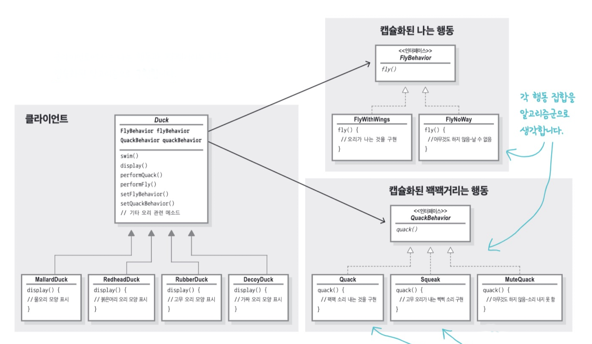

## 전략 패턴(Strategy Pattern)

알고리즘 군을 정의하고 캡슐화해서 각각의 알고리즘군을 수정해서 쓸 수 있게 해줍니다. 전략 패턴을 사용하면 클라이언트로부터 알고리즘을 분리해서 독립적으로 변경할 수 있습니다.

### 실습 코드

#### 1. 예시코드 확인 (_01_before)

- 다양한 오리가 등장하는 게임을 만들기 위해 Duck이라는 슈퍼클래스를 만들고 상속하게 함

#### 2. 요구사항 추가 (_02_add_fly)

- 새로운 요구사항인 `fly()`를 `Duck`에 추가했으나, 심각한 문제가 발생함.
  - 모든 오리가 날기 시작한다. 
  - 날지 않아야 하는 오리는 `fly()`를 다 오버라이드 해줘야된다.
  - 서브 클래스에서 코드가 중복된다.
  - 모든 오리의 행동을 알기 어려워졌다.
  - 실행 시에 특징을 바꾸기 힘들다.
  
  

#### 3. 인터페이스 설계 (_03_change_interface)

2번의 문제를 해결하기 위해 `Flyable`, `Quackable` 인터페이스를 정의해서 각 기능이 필요한 오리에 `implements` 한다. 하지만 이 또한 바보 같은 아이디어였으니, 날아가는 동작이 서브 클래스에서 구현되기 때문에 조금 고치기 위해 48개의 오리를 다 고쳐야하는 상황이 오게된다. 

#### 4. 캡슐화 (_04_encapsulation)

소프트웨어는 아무리 디자인을 잘한다 한들 시간이 지남에 따라 변화하고 성장한다. 이런 소프트웨어를 고칠 때 기존 코드에 미치는 영향을 최소한으로 줄이면서 작업할 수 있는 방법이 있다면 정말 행복할 것이다. 

3가지 디자인 원칙을 알아보자.

**디자인 원칙 1**

애플리케이션에서 달라지는 부분을 찾아내고 달라지지 않는 부분과 분리한다. 즉 `캡슐화`한다.

- 이 원칙을 지키면 바뀌는 부분은 따로 뽑아서 캡슐화하기 때문에 나중에 바뀌지 않는 부분에 영향을 미치지 않고 그 부분만 고치거나 확장할 수 있게 된다.

**디자인 원칙 2**

구현보다는 인터페이스 맞춰서 프로그래밍한다.

- 이전 방법은 특정 구현에 의존했기 때문에 코드를 추가하지 않는 이상 행동을 변경할 여지가 없었다. 행동을 특정 행동 인터페이스를 구현한 별도 클래스 안에 넣으면 `Duck` 클래스에서는 그 행동을 구체적으로 구현할 필요가 없다.

**디자인 원칙 3**

상속보다는 구성을 활용한다.

- 구성을 활용하면 `A는 B이다(상속)`가 아닌 `A에는 B가 있다.(구성)` 을 통해 시스템 유연성을 향상 시킬 수 있다. 단순히 알고리즘 군을 별도의 클래스 집합으로 캡슐화할 수 있으며 구성 요소로 사용하는 객체에서 올바른 행동 인터페이스를 구현하기만 하면 실행 시에 행동을 바꿀 수도 있다.
