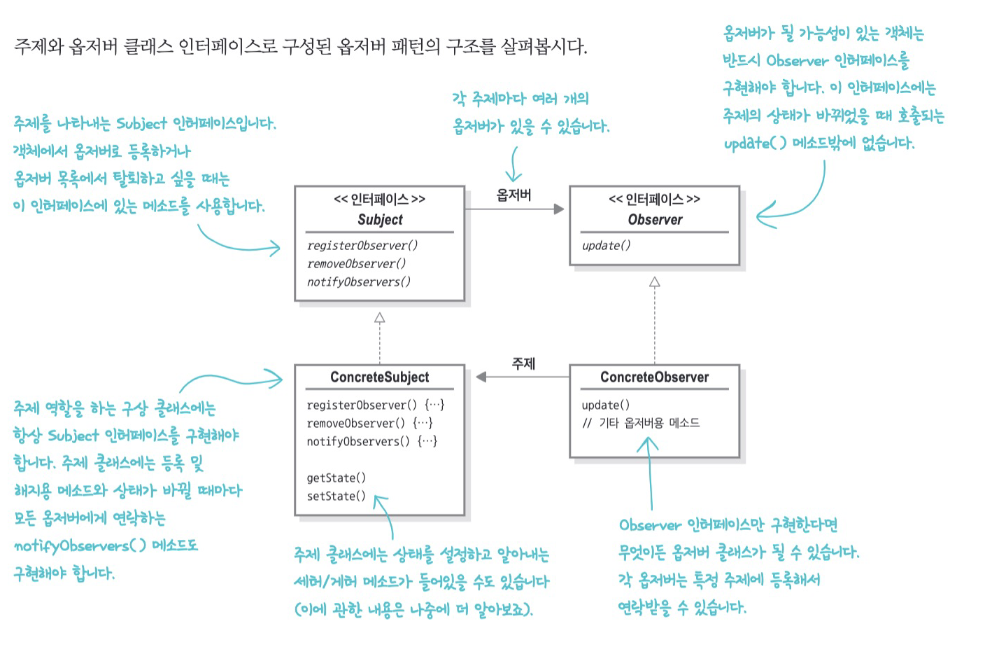
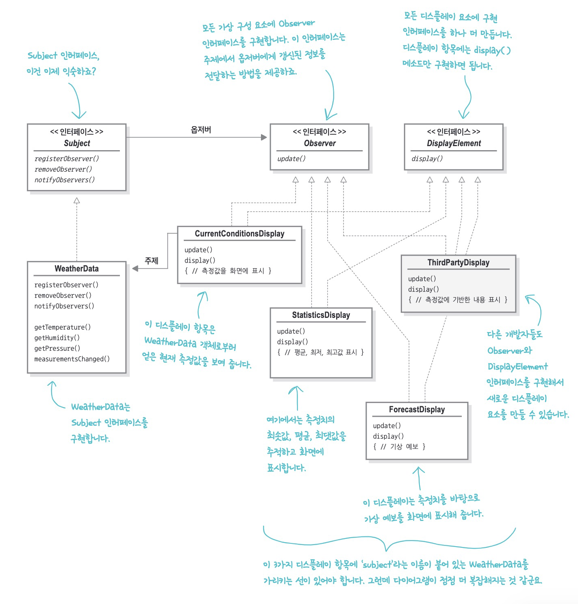

## 옵저버 패턴(Observer pattern)

한 객체의 상태가 바뀌면 그 객체에 의존하는 다른 객체에게 연락이 가고 자동으로 내용이 갱신되는 방식으로 일대다 의존성을 정의한다.


```json
-- 신문 구독 flow --
1. 신문사가 신문을 찍어낸다
2. 독자가 특정 신문사에 구독 신청을 하면 매번 새로운 신문이 나올 때마다 배달을 받으며, 구독을 해지하기 전까지 신문을 계속 받을 수 있다.
3. 신문을 더 이상 보고싶지 않으면 구독해지 신청을 한다.
4. 신문사가 망하지 않는 이상 개인, 호텔 등 여러 고객이 꾸준히 신문을 구독하거나 해지한다.
```



**신문사(주제, subject) + 구독자(옵저버, observer) = 옵저버 패턴**


1. Duck이 주제한테 옵저버가 되고 싶다고 한다. 
2. Duck을 옵저버에 추가한다.
3. 주제 값이 바뀌면 Duck을 포함한 모든 옵저버가 주제 값이 바뀌었다는 연락을 받는다
4. Mouse가 옵저버에서 탈퇴하고 싶다는 요청을 한다.
5. Mouse를 옵저버에서 제외한다.


보통 주제 인터페이스와 옵저버 인터페이스가 들어있는 클래스 디자인으로 구현한다.


> 출판-구독 패턴(pub-sub pattern)과 관계가 있지만 같진 않다. 출판-구독 패턴은 구독자가 서로 다른 유형의 메시지에 관심을 가질 수 있고, 출판사와 구독자를 더 세세하게 분리할 수 있는 복잡한 패턴이다.


### 실습 코드

#### 0. 조건 확인

- WeatherData객체 

  - 현재 기상조건 (온도, 기압, 습도) 추적

- 디스플레이 장비

  - 현재 조건, 기상 통계, 간단한 기상 예보 출력
  - 실시간으로 WeatherData 객체에서 최신 측정치 수집 및 갱신

- 개발자가 직접 날씨 디스플레이를 만들어서 넣을 수 있도록 확장가능해야 함

  

#### 1. 구현 목표 (_01_before)

- 디스플레이를 구현하고 새로운 값이 들어올 때마다(measurementsChanged() 메서드 호출될 때마다) WeatherData에서 디스플레이를 업데이트 해야 함
- WeatherData 클래스에는 3가지 측정값(온도, 습도, 기압)의 게터 메서드
- 새로운 기상 측정 데이터가 들어올 때마다 measurementsChanged() 메소드 호출
  - 이 메소드가 어떤 식으로 호출되는지는 모르며, 알필요도 없음
- 디스플레이 요소 3가지 구현 (WeatherData에서 새로운 측정값이 들어올 때마다 디스플레이 갱신)
  - 현재 조건 디스플레이, 기상 통계 디스플레이, 기상 예보 디스플레이
- 디스플레이를 업데이트하도록 measurementsChanged() 메소드에 코드 추가


> 추가 목표 
> : 다른 개발자가 디스플레이를 만들 수 있도록 사용자가 마음대로 디스플레이 요소를 더하거나 뺄 수 있도록 해주자


#### 2. 기상 스테이션용 코드 추가하기 (_02_add_station)

- 구체적인 구현에 맞춰서 코딩했기 때문에 프로그램을 고치지 않고서는 다른 디스플레이를 추가하거나 제거할 수 없음
- display를 업데이트하는 곳은 바뀔 수 있는 부분이기 때문에 캡슐화 해야 함

- 옵저버 패턴을 적용해보자


#### 3. 기상 스테이션 구현하기(_03_change_to_observer_pattern)



- 느슨한 결합의 위력(Loose Coupling)
  - 객체들이 상호작용할 수는 있지만, 서로를 잘 모르는 관계 (유연성 good)
  - 주제는 옵저버가 특정 인터페이스(observer)를 구현한다는 사실만 안다
  - 옵저버는 언제든지 새로 추가할 수 있다.
    - 주제는 Observer 인터페이스를 구현하는 객체의 목록에만 의존하므로 언제든지 새로운 옵저버를 추가할 수 있다.
  - 새로운 형식의 옵저버를 추가할 때도 주제를 변경할 필요가 없다.
  - 주제와 옵저버는 서로 독립적으로 재사용할 수 있다.
  - 주제나 옵저버가 달라져도 서로에게 영향을 미치지는 않는다.


> 디자인 원칙 4
> 상호작용하는 객체 사이에는 가능하면 느슨한 결합을 사용해야 한다.


#### 4. 라이브러리 속 옵저버 패턴 알아보기 (_04_swing_library)

- 스윙 라이브러리
  - 스윙 : 사용자 인터페이스 용도의 자바 GUI 툴킷
  - JButton의 슈퍼클래스 AbstractButton에 리스너를 추가하고 제거하는 메서드가 있음
  - 이런 메소드들은 스윙 구성요소에서 일어나는 다양한 유형의 이벤트를 감시하는 옵저버를 추가하거나 제거하는 역할을 함
  - ActionListener은 버튼을 누르는 식의 액션에 귀를 기울임

> Q. 자바에는 Observable 클래스도 있지 않나요?
> A. 자바에는 옵저버 패턴용 Observable 클래스와 Observer 인터페이스가 있었어요. Observable 클래스는 우리가 직접 코드를 작성하지 않아도 옵저버를 추가하고 삭제하고 알림을 보내는 메소드를 제공했습니다. Observer인터페이스는 update() 메소드를 포함하여 우리가 만든것과 유사한 인터페이스를 제공했죠. 이 클래스들은 자바 9이후로 쓰이지 않습니다. 각자 자신의 코드에서 기본적인 옵저버 패턴을 지원하는게 더 편하다고 생각하는 사람들과 더 강력한 기능을 스스로 구현하는게 낫다고 생각하는 사람들이 늘어나면서 사라지고 말았습니다.
>
> Q. 자바에서 그런 클래스들을 대신할 만한 기능을 새로 탑재해 주지 않나요?
> A. 자바빈은 Bean에서 PropertyChangeEvents로 유형 속성이 바뀌었을 때 PropertyChangeListener에 알림을 보내주는 기능을 제공합니다. 또한 비동기 스트림을 처리하는 Flow API와 관련된 출판-구독 구성요소도 제공합니다.
>
> Q. 주제에서 옵저버로 알림이 가는 순서를 정해야하나요?
> A. Observer를 알림 순서에 의존하지 말라는 JDK권고가 있습니다.


#### 5. 푸시를 풀로 바꾸기 (_05_change_to_pull)

- 나중에 풍속 같은 새로운 데이터값이 추가된다면 모든 디스플레이의 update()를 바꿔줘야 함.
- 주제가 옵저버로 데이터를 보내는 push를 사용하거나 옵저버가 주제로부터 데이터를 당겨오는 pull을 사용하는 방법
- 대체로 옵저버가 필요한 데이터를 골라서 가져가도록 만드는 방법이 더 좋다
  - 시간이 지남에 따라 애플리케이션은 계속 바뀌고 점점 더 복잡해지기 때문에 더 쉽게 확장이 가능하도록 해야 함


#### 6. 디자인 패턴 원칙

앞서 나온 디자인 원칙들을 옵저버 패턴에서 사용하는 곳을 찾아보자

- 디자인 원칙 1
  - 애플리케이션에서 달라지는 부분을 찾아내고, 달라지지 않는 부분과 분리한다
  - 옵저버 패턴에서 변하는 것은 주제의 상태와 옵저버의 개수, 형식입니다. 옵저버 패턴에서는 주제를 바꾸지 않고도 주제의 상태에 의존하는 객체들을 바꿀 수 있습니다. 나중에 바뀔 것을 대비해 두면 편하게 작업할 수 있습니다
- 디자인 원칙 2
  - 구현보다는 인터페이스에 맞춰서 프로그래밍한다.
  - 주제와 옵저버에서 모두 인터페이스를 사용했습니다. 주제는 Subject 인터페이스로 Observer 인터페이스를 구현하는 객체의 등록과 탈퇴를 관리하고, 그런 객체들에게 연락을 돌립니다. 이러면 지금까지 우리가 봐 왔던 것처럼 느슨한 결합을 만들 수 있습니다.
- 디자인 원칙 3
  - 상속보다는 구성을 활용한다. (컴포지션)
  - 옵저버 패턴에서는 구성을 활용해서 옵저버들을 관리합니다. 주제와 옵저버 사이의 관계는 상속이 아니라 구성으로 이루어지니까요. 게다가 실행 중에 구성되는 방식을 사용하니까 더할 나위 없이 좋겠죠.


### 이야기 거리

- 안드로이드 addListener 같은 것도 전략 패턴의 일종이라고 했는데, 옵저버로 볼수도, 전략으로 볼수도 있는 것 같습니다. 
- 자바 네트워크 소녀 네티 - 리액터 패턴도 옵저버 패턴으로부터 시작함
  - reactive stream이 옵저버 패턴에서 푸시를 풀로 바꾼 컨셉을 차용
- pub-sub은 구독자-발행자 사이에 브로커가 있는 차이인 듯