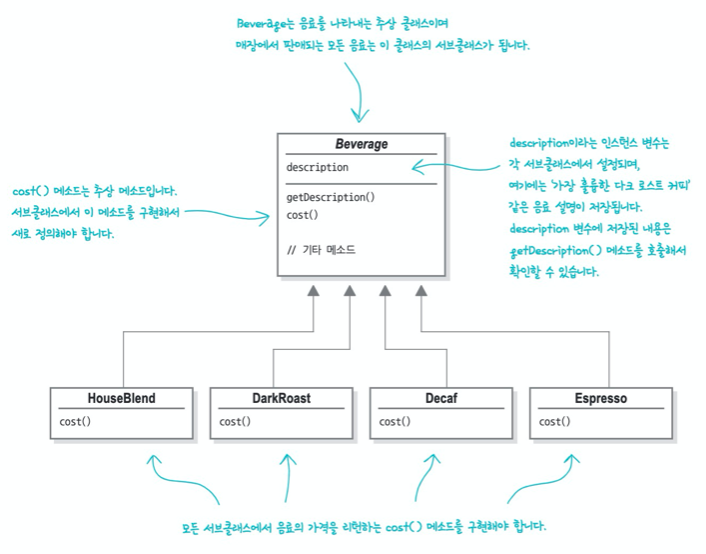
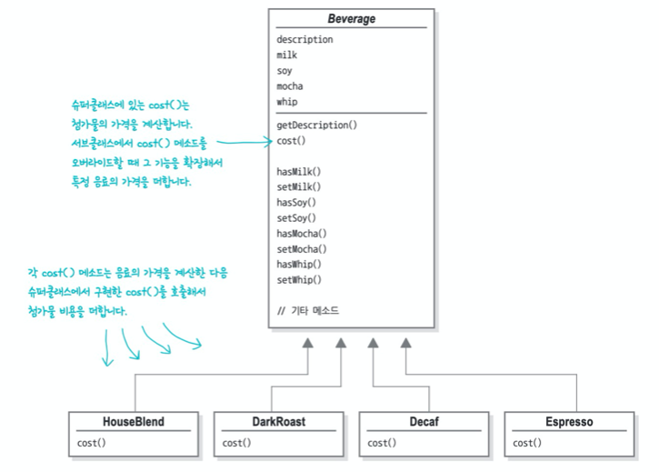
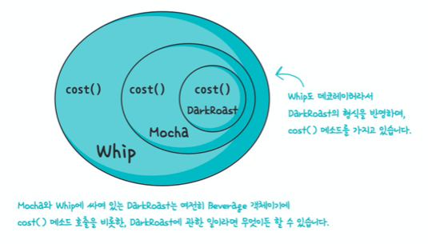
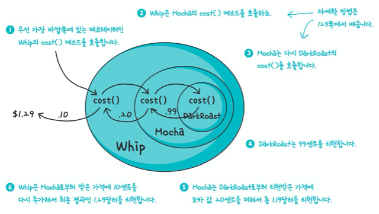
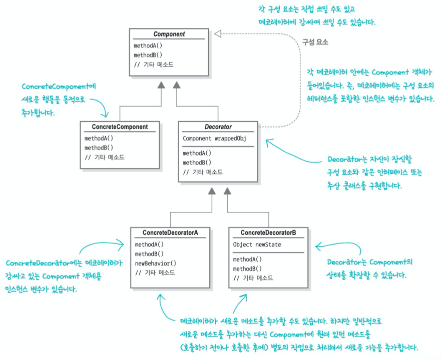
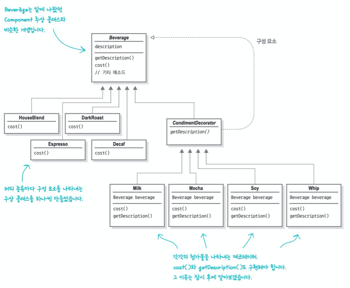
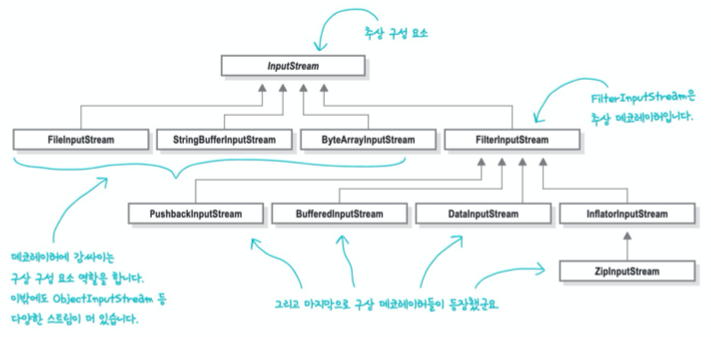
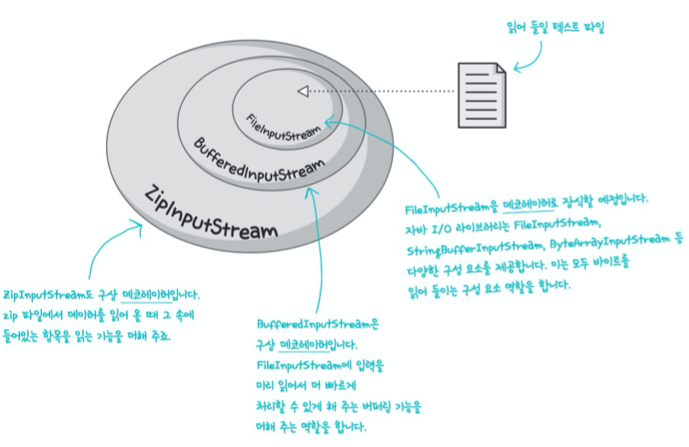

# CHAPTER 03 - 데코레이터 패턴

## 문제 상황

모든 음료가 Beverage를 상속하는 서브클래스가 되어야 한다. 따라서 음료가 추가되는 만큼 서브클래스가 추가되어야 한다. 또한 음료의 첨가물 추가여부(우유, 두유, 모카 등...)에 따라서도 서브클래스가 추가되어야 한다.

## 문제 해결하기 - 1

많은 서브클래스를 생성하지 않고 첨가물 추가여부를 인스턴스 변수(boolean)로서 관리하는 것은 어떨까?

음료의 종류별로만 서브클래스를 생성하고 첨가물의 여부는 Beverage에서 관리함으로써 첨가물에 따른 서브클래스 추가를 피할 수 있게됐다.

이후에 이 디자인에 영향을 미칠만한 요소가 어떤 것이 있을까?

- 첨가물 가격이 바뀔 때마다 Beverage 코드를 수정해야한다.
- 첨가물의 종류가 많아지면 새로운 필드와 메서드를 추가하고, 슈퍼클래스의 cost() 메서드도 수정해야한다.
- 새로운 음료가 출시될 수 있다. 그중에는 특정 첨가물이 들어가면 안 되는 음료도 있을 것이다. 그러나 Beverage를 상속하므로 서브클래스는 모든 속성을 상속받게 된다.
- 첨가물을 2번 추가하는 경우는 어떻게 해야할까?

> OCP (Open-Closed Principle)
>
> 클래스는 확장에는 열려있어야 하지만 변경에는 닫혀 있어야한다.
>
> (= 기능을 추가함에 있어 기존 코드를 수정하는 것이 아닌, 새로운 코드를 추가(확장)함으로써 목적을 달성할 수 있어야 한다.)
>
> ex. 2장에서 배운 옵저버 패턴에서도 옵저버를 새로 추가하더라도 주제에는 코드를 추가하지 않으면서도 확장할 수 있었다.
>
> OCP를 지키다 보면 새로운 단계의 추상화가 필요한 경우가 있는데, 추상화를 하다 보면 코드가 복잡해지기 때문에 디자인 과정에서 가장 바뀔 가능성이 높은 부분을 중점적으로 살펴보고 OCP를 적용하는 방법이 가장 좋다.

## 문제 해결하기 - 2

상속을 써서 음료 가격과 첨가물 가격을 합해서 총 가격을 산출하는 첫번째 해결 방법 방법은 그리 좋은 방법이 아니었다. 클래스가 어마어마하게 많아지거나 일부 서브클래스에는 적합하지 않은 기능을 추가해야 하는 문제가 있었다

다른 방법으로 일단 특정 음료에서 시작해서 첨가물로 그 음료를 `장식(decorate)`하는 것은 어떨까?

1. DarkRoast 객체를 가져온다.
2. Mocha 객체로 장식한다.
3. Whip 객체로 장식한다.
4. cost() 메서드를 호출한다. 이때 첨가물의 가격을 계산하는 일은 해당 객체에게 위임한다.

### 주문 시스템에 데코레이터 패턴 적용하기

DarkRoast 객체에서 시작해서 Mocah 객체를 만들고 감싸고, Whip 객체를 만들어 감싼다.

가격을 계산할 때는 가장 바깥쪽에 있는 데코레이터인 Whip의 cost를 호출하고 Whip은 그 객체가 장식하고 있는 객체에게 가격 계산을 위임한다.

위 내용을 정리하면,

- 데코레이터의 슈퍼클래스는 자신이 장식하고 있는 객체의 슈퍼클래스와 같다.
- 한 객체를 여러 개의 데코레이터로 감쌀 수 있다.
- 데코레이터는 자신이 감싸고 있는 객체와 같은 슈퍼클래스를 가지고 있기에 원래 객체가 들어갈 자리에 데코레이터 객체를 넣어도 상관없다.
- **데코레이터는 자신이 장식하고 있는 객체에게 어떤 행동을 위임하는 일 말고도 추가 작업을 수행할 수 있다.**
- 객체는 언제든지 감쌀 수 있으므로 실행 중에 필요한 데코레이터를 마음대로 적용할 수 있다.

## 데코레이터 패턴의 정의

**데코레이터 패턴**으로 객체에 추가 요소를 동적으로 더할 수 있다. 데코레이터를 사용하면 서브클래스를 만들 때보다 훨씬 유연하게 기능을 확장할 수 있다.

다음과 같은 클래스 다이어그램으로 표현할 수 있고,

위의 문제 상황에 적용하면 다음과 같이 해결할 수 있다.

> Q) 왜 구성(composition)이 아니라 상속(extends)일까?
>
> CondimentDecorator에서 Beverage를 '상속'을 통해 확장하고 있다. 데코레이터는 그 데코레이터로 감싸는 객체의 형식과 같다는 점이 중요한 부분이다. 그래서 데코레이터 패턴에서는 상속을 사용해서 형식을 맞추는 것이다. **상속으로 행동을 물려받으려는 것이 아니다.**

## 데코레이터가 적용된 예: 자바I/O

