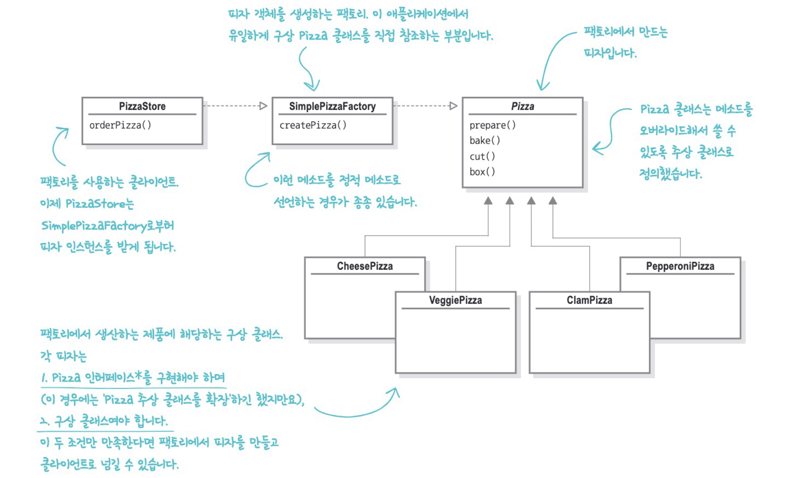
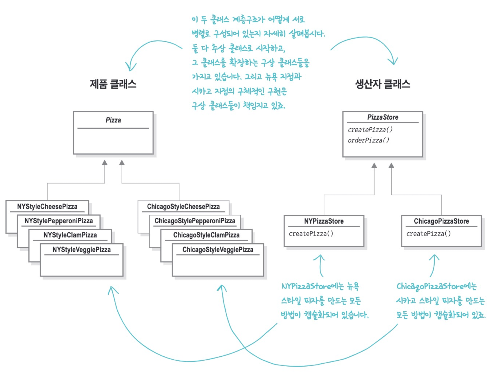
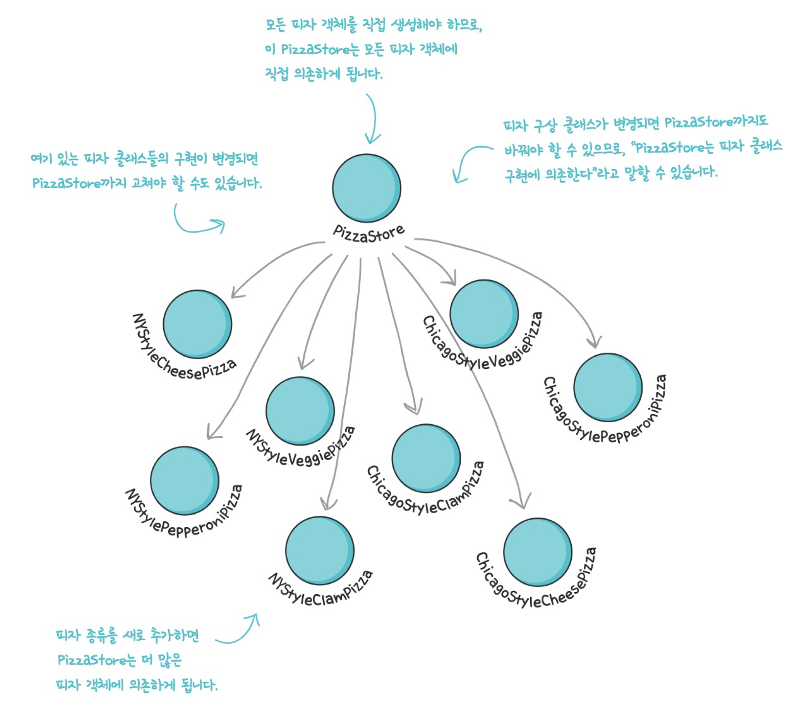
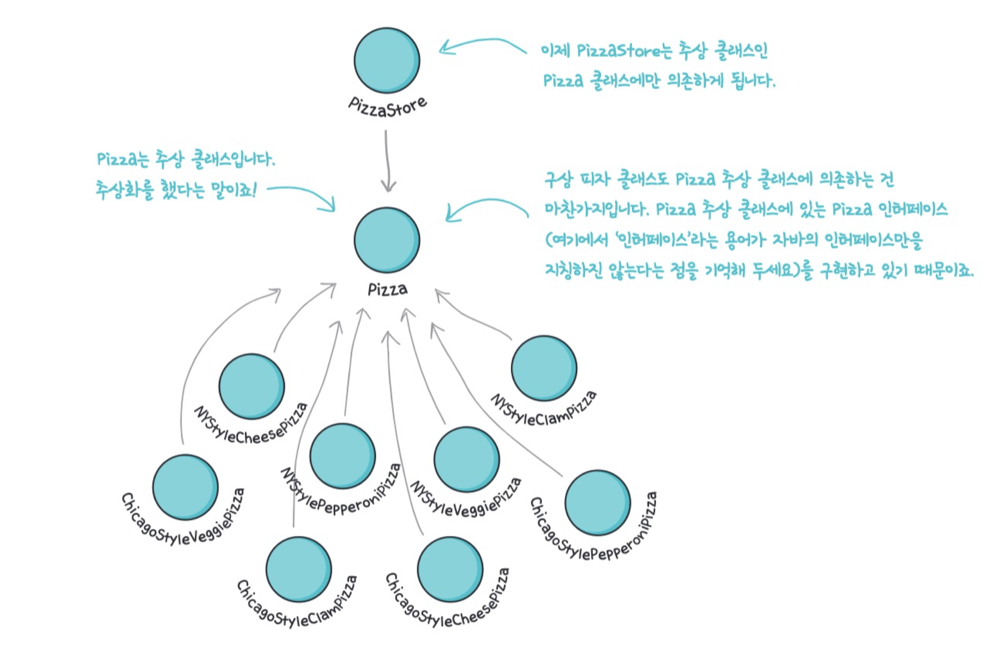
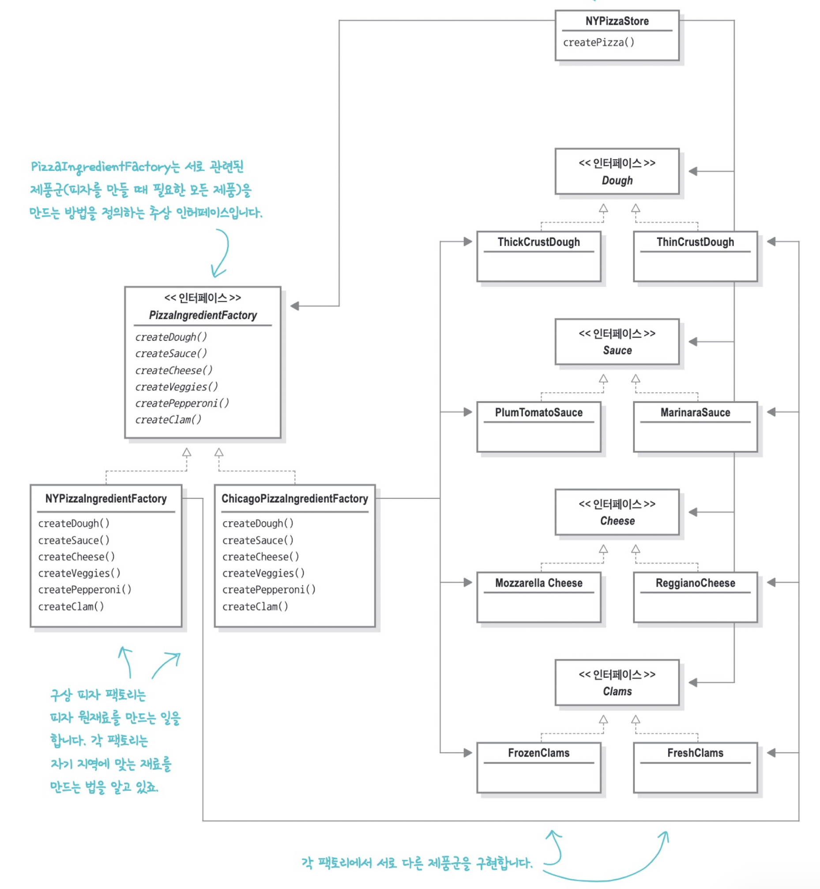
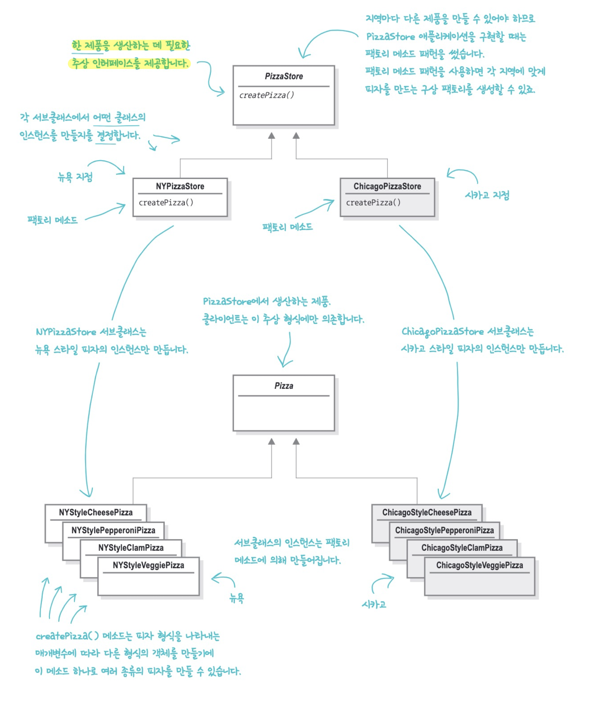
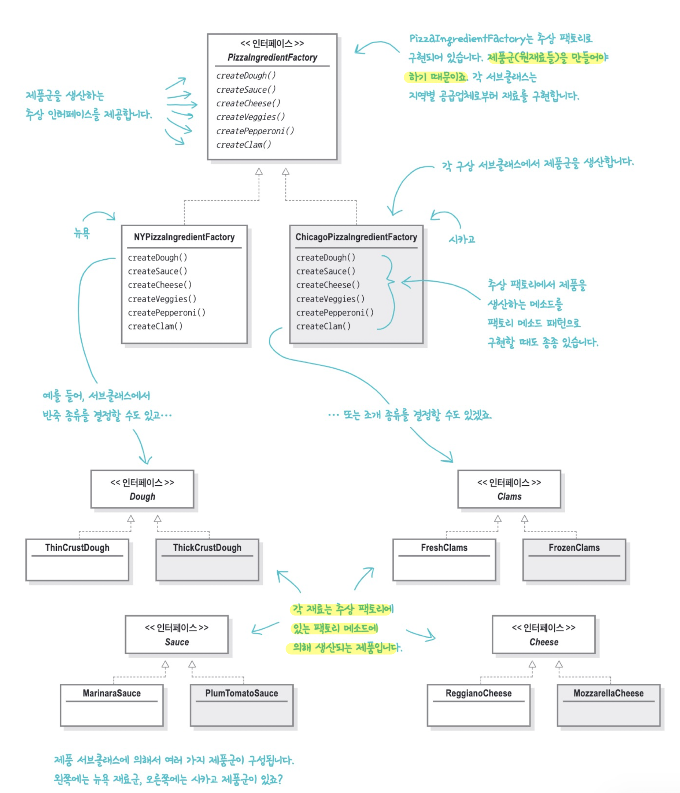

# 팩토리 패턴(Factory Pattern)
팩토리 패턴에는 크게 3가지가 있다.

- 간단한 팩토리 패턴
- 팩토리 메소드 패턴
- 추상 팩토리 패턴

모든 팩토리 패턴은 애플리케이션의 구상 클래스 의존성을 줄여줌으로써 느슨한 결합을 도와준다.


## 실습 코드

### 1. 예시코드 확인 (_01_before)

```java
public Pizza orderPizza(String type) throws Exception {
  Pizza pizza;

  // 변하는 코드
  if (type.equals("cheese")) {
    pizza = new CheesePizza();
  } else if (type.equals("greek")) {
    pizza = new GreekPizza();
  } else if (type.equals("pepperoni")) {
    pizza = new PepperoniPizza();
  } else {
    throw new Exception("잘못된 피자 타입입니다");
  }

  pizza.prepare();;
  pizza.bake();
  pizza.cut();
  pizza.box();

  return pizza;
}
```

***PizzaStore.java***

피자 종류를 전달 받아 종류에 따라 구상 클래스로부터 인스턴스를 만들어 대입하고 있다. 피자 타입이 추가될 때마다 클라이언트 코드 변경 발생한다. 


### 2. 변하는 부분 추상화 (_02_simple_factory)



```java
public Pizza orderPizza(String type) {
  Pizza pizza;

  pizza = factory.createPizza(type);

  pizza.prepare();;
  pizza.bake();
  pizza.cut();
  pizza.box();

  return pizza;
}
```

***PizzaStore.java***

```java
public class SimplePizzaFactory {
    public Pizza createPizza(String type) {
        Pizza pizza = null;

        if (type.equals("cheese")) {
            pizza = new CheesePizza();
        } else if (type.equals("greek")) {
            pizza = new GreekPizza();
        } else if (type.equals("pepperoni")) {
            pizza = new PepperoniPizza();
        } else if (type.equals("clam")) {
            pizza = new ClamPizza();
        } else if (type.equals("veggie")) {
            pizza = new VeggiePizza();
        }
        return pizza;
    }
}
```

***SimplePizzaFactory.java***

객체 생성을 처리하는 클래스를 팩토리(Factory)라고 부른다. 팩토리를 만들면 orderPizza() 메소드는 새로 만든 객체의 클라이언트가 된다. 즉 새로 만든 객체를 호출하게된다. 더 이상 어떤 피자를 만들지 고민하지 않아도 된다.

> **결국 다른 객체로 문제를 옮긴거 아냐?**
>
> 객체 생성을 팩토리라는 특정 클래스로 옮기면 `PizzaShopMenu`, `HomeDelivery` 등에서도 중복 없이 객체 생성 작업을 처리할 수 있다. 즉 변경 시 여기 저기 고칠 필요가 없다.


### 3. 다양한 팩토리 만들기 (_03_factory_diversify)

```java
public static void main(String[] args) {
  NYPizzaFactory nyPizzaFactory = new NYPizzaFactory();
  PizzaStore nyStore = new PizzaStore(nyPizzaFactory);
  nyStore.orderPizza("Veggie");

  WrongPizzaFactory wrongPizzaFactory = new WrongPizzaFactory();
  PizzaStore wrongPizzaStore = new PizzaStore(wrongPizzaFactory);
  wrongPizzaStore.orderPizza("pepperoni");
}
```

***실행 코드***

이제 다양한 지점을 내기 위해 각 지점마다 지역의 특성과 입맛을 반영한 다양한 스타일의 피자를 만들기로했다. 지역마다 적절한 팩토리를 만들고 `PizzaStore`에서 사용하도록 했다. 하지만 `PizzaStore`와 관계 없이 잘못된 팩토리를 넘기면 이상한 피자가 나오기 시작했다. 그렇다고 `1. 예시코드 확인`때처럼 다시 피자 만드는 코드와 `PizzaStore`를 연결하면 유연성이 떨어지게된다. 


### 4. 팩토리 메서드 패턴 적용 (_04_factory_method_pattern)

피자를 만드는 일 자체는 전부 `PizzaStore` 클래스에서 진행하면서도 지점의 스타일을 살릴 수 있는 방법이 있다. `createPizza()` 추상 메소드를 선언하고 지역별 스타일에 맞게 `PizzaStore`를 만들어보자.

```java
public abstract class PizzaStore {
	abstract Pizza createPizza(String item);

	public Pizza orderPizza(String type) {
		Pizza pizza = createPizza(type);
		System.out.println("--- Making a " + pizza.getName() + " ---");
		pizza.prepare();
		pizza.bake();
		pizza.cut();
		pizza.box();
		return pizza;
	}
}

```

***PizzaStore.java***

```java
public class NYPizzaStore extends PizzaStore {

	Pizza createPizza(String item) {
		if (item.equals("cheese")) {
			return new NYStyleCheesePizza();
		} else if (item.equals("veggie")) {
			return new NYStyleVeggiePizza();
		} else if (item.equals("clam")) {
			return new NYStyleClamPizza();
		} else if (item.equals("pepperoni")) {
			return new NYStylePepperoniPizza();
		} else return null;
	}
}
```

***NYPizzaStore.java***

이렇게 하면 `orderPizza()`에서 실제로 어떤 서브클래스에서 피자를 만드는지 알 수 없게 된다. 피자의 종류는 어떤 서브클래스를 선택했느냐에 따라 결정된다. `PizzaStore`와 `구상 클래스 Pizza`는 완전히 분리되는 것이다.




이렇게 서브 클래스에서 어떤 클래스를 만들지 결정함으로서 객체 생성을 캡슐화하는 방법을 팩토리 메서드 패턴이라고 한다. 팩토리 메서드에는 `생성자(Creator)`, `제품(Product)` 클래스가 존재한다.


> 
>
> **팩토리 메서드 패턴**
>
> 객체를 생성할 때 필요한 인터페이스를 만든다. 어떤 클래스의 인스턴스를 만들지는 서브클래스에서 결정한다. 팩토리 메소드 패턴을 사용하면 클래스 인스턴스 만드는 일을 서브클래스에 맡기게 된다. 


```java
public class DependentPizzaStore {

	public Pizza createPizza(String style, String type) {
		Pizza pizza = null;
		if (style.equals("NY")) {
			if (type.equals("cheese")) {
				pizza = new NYStyleCheesePizza();
			} else if (type.equals("veggie")) {
				pizza = new NYStyleVeggiePizza();
			} else if (type.equals("clam")) {
				pizza = new NYStyleClamPizza();
			} else if (type.equals("pepperoni")) {
				pizza = new NYStylePepperoniPizza();
			}
		} else if (style.equals("Chicago")) {
			if (type.equals("cheese")) {
				pizza = new ChicagoStyleCheesePizza();
			} else if (type.equals("veggie")) {
				pizza = new ChicagoStyleVeggiePizza();
			} else if (type.equals("clam")) {
				pizza = new ChicagoStyleClamPizza();
			} else if (type.equals("pepperoni")) {
				pizza = new ChicagoStylePepperoniPizza();
			}
		} else {
			System.out.println("Error: invalid type of pizza");
			return null;
		}
		pizza.prepare();
		pizza.bake();
		pizza.cut();
		pizza.box();
		return pizza;
	}
}
```

***DependentPizzaStore.java***

다시 돌아가서 객체 인스턴스를 직접 만들어 구상 클래스에 의존했던 코드를 봐보자.




위 코드는 그림처럼 `PizzaStore`가 모든 `Pizza` 객체에 직접 의존하게된다. 구상 클래스가 변경됨에 따라 `PizzaStore`도 바꿔야할 수 있으므로 의존성이 높은 상태다. 구상 클래스 의존성을 줄이면 좋겠을 때, 적용할만한 원칙이 있다.

> **디자인 원칙. 의존성 뒤집기 원칙(DIP, Dependency Inversion Principle)**
>
> 추상화된 것에 의존하게 만들고 구상 클래스에 의존하지 않게 만든다.




우리는 팩토리 메서드 `createPizza()`를 사용해 `PizzaStore`가 `Pizza` 클래스에만 의존하게 하고, 피자 구상 클래스도 `Pizza`를 의존하게하면서 의존성 뒤집기 원칙을 지킬 수 있게 되었다.


### 5. 추상 팩토리 패턴 적용 (_05_abstract_factory_pattern)

팩토리 메서드 패턴을 이용해 생성자 클래스(`PizzaStore`)에 **한 제품**을 생산하는데 필요한 추상 인터페이스를 제공했다. 각 지역에 맞게 피자를 만드는 구상 팩토리(`NYPizzaStore`)를 생성했다. 

이번에는 한 제품이 아닌 **제품군**을 만드는 과정을 추상화하는 방법에 대해 알아보도록 하자.

`PizzaStore` 디자인이 모양새를 갖추고 신선하고 품질 좋은 재료로 사업이 번창하고 있다. 그러나 몇몇 지점에서 인플레이션으로 인한 원가 상승으로 인해, 원가 절감을 위해 질 낮은 재료로 바꿔 마진을 높이고 있다고 한다. 

```java
public interface PizzaIngredientFactory {
 
	public Dough createDough();
	public Sauce createSauce();
	public Cheese createCheese();
	public Veggies[] createVeggies();
	public Pepperoni createPepperoni();
	public Clams createClam();
 
}
```

***PizzaIngredientFactory.java***

원재료를 생산하는 공장까지 만들고 지점까지 재료를 직접 배달하면 해결되지 않을까? 우선 모든 원재료를 생산하는 팩토리용 인터페이스(`PizzaIngredientFactory.java`)를 정의한다.


```java
public class NYPizzaIngredientFactory implements PizzaIngredientFactory {
 
	public Dough createDough() {
		return new ThinCrustDough();
	}
 
	public Sauce createSauce() {
		return new MarinaraSauce();
	}
 
	public Cheese createCheese() {
		return new ReggianoCheese();
	}
 
	public Veggies[] createVeggies() {
		Veggies veggies[] = { new Garlic(), new Onion(), new Mushroom(), new RedPepper() };
		return veggies;
	}
 
	public Pepperoni createPepperoni() {
		return new SlicedPepperoni();
	}

	public Clams createClam() {
		return new FreshClams();
	}
}
```

***NYPizzaIngredientFactory.java***

그리고 각 지역에 재료를 공급할 구상 팩토리 클래스를 구현한다. 


```java
public abstract class Pizza {
	String name;
	Dough dough;
	Sauce sauce;
	Veggies veggies[];
	Cheese cheese;
	Pepperoni pepperoni;
	Clams clam;

	/**
	 * 추상 메소드로 변경 원자료는 원재료 팩토리에서 가져오도록 한다.
	 */
	abstract void prepare();

	void bake() {
		System.out.println("175도에서 25분 간 굽기");
	}

	void cut() {
		System.out.println("피자를 사선으로 자르기");
	}

	void box() {
		System.out.println("상자에 피자 담기");
	}

	void setName(String name) {
		this.name = name;
	}

	String getName() {
		return name;
	}

	public String toString() {
		// 피자 이름 출력
	}
}
```

***Pizza.java***

그리고 `Pizza` 클래스가 팩토리에서 생성한 원재료만 사용하도록 코드를 고친다.


```java
public class CheesePizza extends Pizza {
	PizzaIngredientFactory ingredientFactory;
 
	public CheesePizza(PizzaIngredientFactory ingredientFactory) {
		this.ingredientFactory = ingredientFactory;
	}
 
	void prepare() {
		System.out.println("Preparing " + name);
		dough = ingredientFactory.createDough();
		sauce = ingredientFactory.createSauce();
		cheese = ingredientFactory.createCheese();
	}
}
```

***CheesePizza.java***

이제 재료를 팩토리부터 받아서 쓰는 치즈 피자를 구현해보자. 지점에서 마음대로 싸구려 재료를 쓰던 시대는 갔습니다. 이전에 지역 별로 만들었던 `NYCheesePizza`, `ChicagoCheesePizza`를 기억해봅시다. 두 클래스는 지역별로 다른 재료를 사용한다는 것만 빼면 똑같은 형식이었다. 따라서 피자마다 클래스를 지역별로 만들 필요가 없어졌다. 원재료는 팩토리에서 받아온다.


```java
public class NYPizzaStore extends PizzaStore {
 
	protected Pizza createPizza(String item) {
		Pizza pizza = null;
		PizzaIngredientFactory ingredientFactory = new NYPizzaIngredientFactory();
 
		if (item.equals("cheese")) {
			pizza = new CheesePizza(ingredientFactory);
			pizza.setName("New York Style Cheese Pizza");
		} else if (item.equals("veggie")) {
			pizza = new VeggiePizza(ingredientFactory);
			pizza.setName("New York Style Veggie Pizza");
		} else if (item.equals("clam")) {
			pizza = new ClamPizza(ingredientFactory);
			pizza.setName("New York Style Clam Pizza");
		} else if (item.equals("pepperoni")) {
			pizza = new PepperoniPizza(ingredientFactory);
			pizza.setName("New York Style Pepperoni Pizza");
		}

		return pizza;
	}
}
```

***NYPizzaStore.java***

이제 다시 가게로 돌아옵시다. 뉴욕 피자 지점에서는 올바른 재료를 전달 받고 피자를 만들게 된다. 우리는 `PizzaIngredientFactory`라는 새로운 형식의 추상 팩토리를 통해 피자 종류에 맞는 원재료군을 생산하는 방법을 구축했다. 



클라이언트에서 추상 인터페이스로 구현된 일련의 제품을 공급 받을 수 있게 됐다. 실제로 어떤 제품이 생산되는지 전혀 알 필요 없어졌다. 따라서 클라이언트와 팩토리에서 생산되는 제품군이 분리될 수 있다. 


> 
>
> **추상 팩토리 패턴**
>
> 구상 클래스에 의존하지 않고도 연관되거나 의존적인 객체로 이루어진 제품군을 생산하는 인터페이스를 제공한다.


### 6. 팩토리 메소드 패턴과 추상 팩토리 패턴

둘 다 애플리케이션을 특정 구현으로부터 분리하는 일을 한다. 



***팩토리 메소드 패턴 다이어그램***

클라이언트는 구상 형식을 서브클래스에서 처리해주니 자신이 사용할 추상 형식만 알면 된다. 클라이언트와 구상 형식을 분리한다. 한 가지 제품을 생성하는 로직을 추상화 해준다. 

구체적인 객체 생성 과정을 하위 또는 구체적 클래스로 옮기는 것이 목적이다. **팩토리를 구현하는 방법**(서브클래스 사용)에 초점을 둔다.



***추상 팩토리 패턴 다이어그램***

한가지가 아닌 여러 제품군의 생성을 추상화해준다. 하지만 새로운 제품이 추가되면 인터페이스를 바꿔야하는(예를 들어 고기 제품을 추가하기위해 `createMeet()` 추가 필요) 단점도 있다.

관련있는 여러 객체를 구체적인 클래스에 의존하지 않고 만들 수 있게 해주는 것이 목적이다. **팩토리를 사용하는 방법**(인터페이스의 `createXXX()`)에 초점을 둔다.


## 사용 예시

### 자바에서의 심플 팩토리 패턴

**Calendar**

```java
Calendar.getInstance() // GregorianCalendar
Calendar.getInstance(Locale.forLanguageTag("TH")) // BuddhistCalendar
Calendar.getInstance(Locale.forLanguageTag("JP")) // JapaneseImperialCalendar
```

`Calendar.getInstance()`는 언어에 따라 다른 객체를 생성해준다.


### 스프링에서의 팩토리 메소드 패턴

**BeanFactory**

```java
ClassPathXmlApplicationContext xmlFactory = new ClassPathXmlApplicationContext("config.xml");
Bean bean = xmlFactory.getBean("hello", String.class);

AnnotationConfigApplicationContext javaFactory = new AnnotationConfigApplicationContext(Config.class);
Bean bean = javaFactory.getBean("hello", String.class);
```

각기 다른 `ConcreateCreator` 역할을 하는 다양한 `ApplicationContext`를 만들 수 있다. `getBean()`을 통해 각기 다른 `ConcreateProduct`를 가져올 수 있다.


### 자바에서의 추상 팩토리 패턴

**DocumentBuilderFactory**

```java
DocumentBuilderFactory factory = DocumentBuilderFactory.newInstance();
DocumentBuilder documentBuilder = factory.newDocumentBuilder();
Document document = documentBuilder.parse(new File(""));
```

구체적인 구상 클래스를 통해 `newDocumentBuilder()`를 호출하지 않고 추상화된 `DocumentBuilderFactory`를 사용해 호출한다.


## 장/단점

#### 장점
- 클라이언트 코드를 건들지 않고, 새로운 제품을 추가할 수 있다.
- `OCP`, `DIP` 원칙을 준수할 수 있게 해준다.

#### 단점
- 클래스가 늘어난다.


### 이야깃거리
