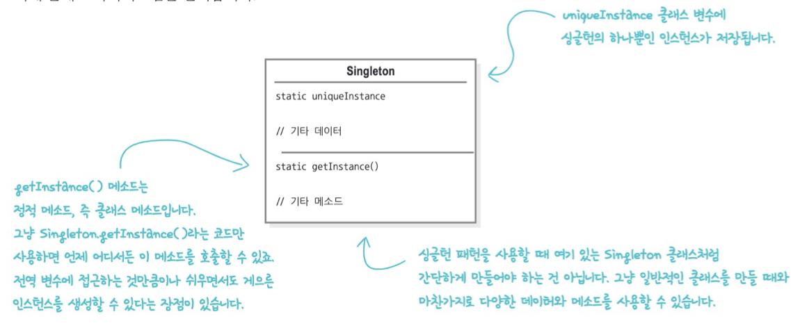
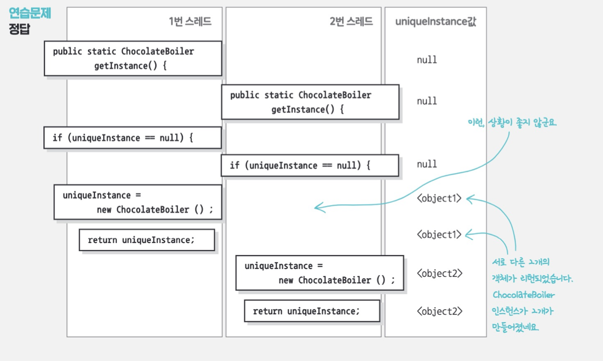

## 5. 싱글턴 패턴

> 클래스 인스턴스를 하나만 만들고, 그 인스턴스로의 전역 접근을 제공

특정 클래스의 인스턴스가 2개 이상이면 프로그램이 예기치 않게 동작하든가, 자원을 불필요하게 잡아먹든가, 결과에 일관성이 없어지는 경우가 있음

이를 방지하기 위해 특정 클래스에 객체 인스턴스가 하나만 만들어질 수 있도록 해주는 패턴

- 전역변수로 사용하지 않는 이유
  - 프로그램이 종료될 때까지 객체를 한번도 사용하지 않았다면, 자원만 잡아먹는 쓸데없는 객체가 됨
- 싱글턴 패턴을 실제로 적용할 때는 클래스에 하나뿐인 인스턴스를 관리하도록 만들면 됨 (다른 클래스에서도 자신의 인스턴스를 추가로 만들지 못하게 막아야 함)
- 어디서든 그 인스턴스에 접근할 수 있도록 전역 접근 지점 제공
  - static getInstance() 를 통해 필요한 시점에 해당 객체를 만드는 lazy 방식으로 구현할 수 있음. (자원을 많이 잡아먹는 인스턴스인 경우에 용이)

- 예시

  - 레지스트리 설정, 스레드 풀(자원 풀 관리) 등

    




### 1. 고전적인 싱글턴 패턴 구현법

```java
public class Singleton {
  private static Singleton uniqueInstance;

  private Singleton() {} // private 생성자

  public static Singleton getInstance() {
    if (uniqueInstance == null) {
      uniqueInstance = new Singleton(); // lazy
    }

    return uniqueInstance;
  }
}
```

- private생성자를 통해 Singleton 에서만 클래스 인스턴스 생성 가능
- Singleton의 하나뿐인 인스턴스를 정적 변수에 저장


### 2. 초콜릿 보일러 코드

- Lazy 생성을 할 때 멀티 스레딩 환경에서 서로 다른 두 스레드가 보일러 객체를 동시에 생성할 수 있는 위험성이 있음




### 3. 멀티스레딩 문제 해결하기

```java
public static synchronized Singleton getInstance() {
  if (uniqueInstance == null) {
    uniqueInstance = new Singleton();
  }

  return uniqueInstance;
}
```

- getInstance에 synchronized 키워드 추가하여 다른 스레드가 접근할 때 기다리도록 변경
- 동기화할 때 속도 문제가 생길 수 있음
- 동기화가 필요한 시점은 이 메소드가 시작될 때 뿐임


### 4. 더 효율적으로 멀티스레딩 문제 해결하기

1. getInstance의 속도가 중요하지 않다면 그냥 둔다.

2. 인스턴스가 필요할 때는 생성하지 말고 처음부터 만든다.

   ```java
   private static StaticSingleton uniqueInstance = new StaticSingleton();
   ```

3. DCL (Double Checked Locking)을 써서 동기화 되는 부분을 줄인다.
   - 인스턴스가 있는지 확인하고 없으면 동기화된 블록으로 들어감
   - `volatile` 
     -  Java 변수를 Main Memory에 저장
     - 매번 변수의 값을 Read할 때마다 CPU cache에 저장된 값이 아닌 Main Memory에서 읽음
     - 또한 변수의 값을 Write할 때마다 Main Memory에 까지 작성


### 5. 문제를 해결하는 적절한 방법 선택하기

- getInstance() 메소드를 동기화하는 방법
  - 항상 올바른 결과가 나온다
  - 속도가 중요하지 않은 경우 (초콜릿 보일러)
- 인스턴스를 시작하자마자 만드는 방법
  - 항상 필요한 인스턴스라면 정적으로 초기화해도 괜찮음
- DCL을 쓰는 방법
  - 속도가 중요하다면 사용
  - 자바 5 이상에서만 쓸 수 있음


### 6. Q&A

- 모든 메서드와 변수가 static으로 선언된 클래스를 만들어도 되지 않나요?
  - 필요한 내용이 클래스에 다 들어있고, 복잡한 초기화가 필요 없는 경우에만 그 방법을 쓸 수 있음
  - 자바에서 정적 초기화를 처리하는 방법 때문에 복잡해질 수 있음 (특히 여러 클래스가 얽혀있는 경우에)
- 클래스 로더 관련 문제
  - 클래스 로더가 2개 이상이라면 클래스 로더마다 서로 다른 네임스페이스를 정의하기에 같은 클래스를 여러번 로딩할 수 있음
  - 따라서 싱글턴이더라도 인스턴스가 여러개 만들어질 수 있음
  - 클래스로더를 직접 지정하면 이 문제를 피할 수 있음
- 리플렉션, 직렬화, 역직렬화 문제
  - 싱글턴에서 문제될 수 있음
- 느슨한 결합 원칙에 위배
  - 상호작용하는 객체 사이에서 최대한 느슨한 결합을 추구하는 것이 해당 원칙이지만, 싱글턴을 사용하다보면 이런 원칙에 위배되기 쉬움
- 한 클래스는 1가지 일만 해야 함
  - 자신의 인스턴스를 관리 + 원래 그 인스턴스를 사용하고자 하는 목적에 부합하는 책임
  - 두가지 책임이 있음
- 싱글턴의 서브 클래스
  - 생성자가 private으로 선언되어 있음. 따라서 서브 클래스를 만드려면 public, protected로 생성자를 선언해야 함
  - 싱글턴은 정적 변수를 바탕으로 구현하기에 모든 서브클래스가 똑같은 인스턴스 변수를 공유하게 됨
  - 싱글턴을 확장해서 무엇을 할 지 고민해보기
  - 애플리케이션에서 싱글턴을 많이 사용했다면 전반적인 디자인을 다시한번 생각해보자
- 전역 변수가 싱글턴보다 나쁜 이유
  - 게으른 인스턴스 생성을 할 수 없다
  - 처음부터 끝까지 인스턴스를 가지고 있어야 한다.
  - 네임스페이스가 지저분하게 만들어진다.


### 7. enum 사용하기

- 동기화, 클래스 로딩, 리플랙션, 직렬화, 역직렬화등은 enum으로 싱글턴을 생성해서 해결 할 수 있음


### 8. Spring에서의 싱글톤

- Java로 기본적인 싱글톤 패턴을 구현하고자 하면 다음과 같은 단점들이 발생한다.
  - private 생성자를 갖고 있어 상속이 불가능하다.
  - 테스트하기 힘들다.
  - 서버 환경에서는 싱글톤이 1개만 생성됨을 보장하지 못한다.
  - 전역 상태를 만들 수 있기 때문에 객체지향적이지 못하다.
- 스프링에서는 싱글톤 형태의 오브젝트를 만들고 관리하는 기능 제공(싱글톤 레지스트리)
  - thread safe를 지원
  - static 메소드나 private 생성자 등을 사용하지 않아 객체지향적 개발을 할 수 있다.


### 이야기거리

- Bean으로 관리되는 클래스를 외부에서 개발자가 new 키워드를 사용하여 객체를 생성하는 경우? 객체 생성될 수 있다.

- kotlin에서는 object 키워드를 통해서 싱글톤 패턴을 활용할 수 있음
- enum으로 싱글톤 패턴 https://scshim.tistory.com/361