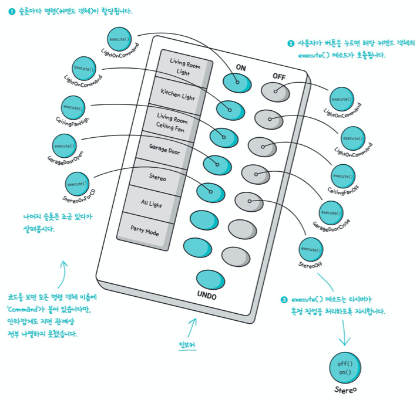

# CHAPTER 06 - 커맨드 패턴

## 문제 상황

만능 리모컨을 이요해서 여러 기기를 제어하고 싶다.


그러나 제어해야하는 기기마다 공통적인 인터페이스가 존재하지 않고 더 추가될 수 있다는 문제가 있다.


이런 문제를 커맨드 패턴을 통해 해결할 수 있다.


## 커맨드 패턴 소개

음식을 주문하는 방법으로 커맨드 패턴을 알아보자. 음식 주문은 다음과 같은 과정을 통해 이루어진다.

1. 고객이 종업원에게 주문을 한다.
2. 종업원은 주문을 받아서 카운터에 전달하고 "주문 들어왔어요!"라고 얘기한다.
3. 주방장이 주문대로 음식을 준비한다.


조금 더 자세하보면 다음과 같다.


- 각 등장인물의 역할
  - 주문서는 주문 내용을 캡슐화한다.
    - 주문서는 주문 내용을 요구하는 객체이다.
    - 이 객체의 인터페이스에는 식사 준비에 필요한 행동을 캡슐화한 orderUp() 메서드가 들어있다.
    - 그리고 그 식살르 주문해야 하는 객체(주방장)의 레퍼런스도 있다.
    - 내용은 캡슐화되어 있어서 종업원은 어떤 메뉴가 주문되었는지, 누가 식사를 준비할 건지 등을 전혀 몰라도 된다.
  - 종업원은 주문서를 받고 orderUp() 메서드를 호출한다.
  - 주방장은 식사를 준비하는 데 필요한 정보를 가지고 있다.
    - 실제로 식사를 준비하는 방법은 주방장만 알고 있다.
    - 주방장과 종업원은 완전히 분리되어 있다.
    - 종업원은 각 주문서에 있는 메서드를 호출할 뿐이고, 주방장은 주문서로 할일을 전달받을 뿐이다.

음식을 주문하는 방법은 **어떤 것을 요구하는 객체와 그 요구를 받아들이고 처리하는 객체를 분리하는 객체지향 디자인 패턴의 한 모델이라고 볼 수 있다.**


## 커맨드 패턴 다이어그램


- 클라이언트 = 고객
- 커맨드 = 주문서
- 인보커 = 종업원
- 리시버 = 주방장


## 커맨드 객체 만들기

### 커맨드 인터페이스 구현

```java
public interface Command {

    public void execute();
}
```

### 조명을 켤 때 필요한 커맨드 클래스 구현

```java
public class LightOnCommand implements Command {
    Light light;
    
    public LightOnCommand(Light light) {
        this.light = light;
    }

    @Override
    public void execute() {
        light.on();
    }
}
```

### 커맨드 객체 사용하기

```java
public class SimpleRemoteControl {
    Command slot;

    public SimpleRemoteControl() {}

    public void setCommand(Command slot) {
        this.slot = slot;
    }
    
    public void buttonWasPreseed() {
        slot.execute();
    }
}
```

### 리모컨을 사용할 때 필요한 간단한 테스트 클래스

```java
public class RemoteControlTest {

    public static void main(String[] args) {
        SimpleRemoteControl remote = new SimpleRemoteControl();
        Light light = new Light();
        LightOnCommand lightOn = new LightOnCommand(light);

        remote.setCommand(lightOn);
        remote.buttonWasPreseed();
    }
}
```


## 커맨드 패턴의 정의

**커맨드 패턴**(Command Pattern)을 사용하면 요청 내역을 객체로 캡슐화해서 객체를 서로 다른 요청 내역에 따라 매개변수화할 수 있다. 이러면 요청을 큐에 저장하거나 로그로 기록하거나 작업 취소 기능을 사용할 수 있다.

커맨드 객체는 일련의 행동을 특정 리시버와 연결함으로써 요청을 캡슐화한 것이다.


## 커맨드 패턴 클래스 다이어그램 살펴보기


**`Invoker`와 `Receiver` 간의 의존성이 없다는 것에 주목해야 한다.**


## 슬롯에 명령 할당하기

지금까지 학습한 내용을 바탕으로 리모컨의 각 슬롯에 명령을 할당해보자. 리모컨이 인보커가 되는 것이다.

사용자가 버튼을 누르면 그 버튼에 맞는 커맨드 객체의 execute() 메서드가 호출되고, 리시버(조명, 선풍기, 오디오 등)에서 특정 행동을 담당하는 메서드가 실행된다.



```java
public class RemoteControl {
    Command[] onCommands;
    Command[] offCommands;

    public RemoteControl() {
        onCommands = new Command[7];
        offCommands = new Command[7];
        
        Command noCommand = new NoCommand();
        for (int i = 0; i < 7; i++) {
            onCommands[i] = noCommand;
            offCommands[i] = noCommand;
        }
    }
    
    public void setCommand(int slot, Command onCommand, Command offCommand) {
        onCommand[slot] = onCommand;
        offCommand[slot] = offCommand;
    }
    
    public void onButtonWasPushed(int slot) {
        onCommands[slot].execute();
    }

    public void offButtonWasPushed(int slot) {
        offCommands[slot].execute();
    }
    
    public String toString() {
        StringBuilder sb = new StringBuilder();
        sb.append("\n----------리모컨----------\n");
        for (int i = 0; i < onCommands.length; i++) {
            sb.append("[slot " + i + "] " + onCommands[i].getClass().getName()
              + " " + offCommands[i].getClass().getName() + "\n");
        }
        return sb.toString();
    }
}
```


## 커맨드 클래스 만들기

```java
public class LightOffCommand implements Command {
    Light light;

    public LightOffCommand(Light light) {
        this.light = light;
    }

    @Override
    public void execute() {
        light.off();
    }
}
```

```java
public class StereoOnWithCDCommand implements Command {
    Stereo stereo;

    public StereoOnWithCDCommand(Stereo stereo) {
        this.stereo = stereo;
    }

    @Override
    public void execute() {
        stereo.on;
        stereo.setCD;
        stereo.setVolume(1);
    }
}
```


## 리모컨 테스트

```java
public class RemoteLoader {

    public static void main(String[] args) {
        RemoteControl remoteControl = new RemoteControl();
        
        Light livingRoomLight = new Light("Living Room");
        Light kitchenLight = new Light("Kitchen Room");
        Stereos stereos = new Stereos("Living Room");
        
        LightOnCommand livingRoomLightOn = new LightOnCommand(livingRoomLight);
        LightOffCommand livingRoomLightOff = new LightOffCommand(livingRoomLight);
        LightOnCommand kitchenRoomLightOn = new LightOnCommand(kitchenLight);
        LightOffCommand kitchenRoomLightOff = new LightOffCommand(kitchenLight);
        StereoOnWithCdCommand stereoOnWithCD = new StereoOnWithCdCommand(stereos);
        StereoOffCdCommand stereoOff = new StereoOffCdCommand(stereos);
        
        remoteControl.setCommand(0, livingRoomLightOn, livingRoomLightOff);
        // 람다를 쓴다면,
        // remoteControl.setCommand(0, () -> livingRoomLight.on(), () -> livingRoomLight.off());
        remoteControl.setCommand(1, kitchenRoomLightOn, kitchenRoomLightOff);
        remoteControl.setCommand(2, stereoOnWithCD, stereoOff);
        
        remoteControl.onButtonWasPushed(0);
        remoteControl.offButtonWasPushed(0);
        remoteControl.onButtonWasPushed(1);
        remoteControl.offButtonWasPushed(1);
        remoteControl.onButtonWasPushed(2);
        remoteControl.offButtonWasPushed(2);
    }
}
```


## 여러 동작을 한 번에 처리하기

버튼 한 개만 누르면 조명이 어두워지면서 오디오와 TV가 켜지고, DVD 모드로 변경되고, 욕조에 물이 채워지는 것까지 한 번에 처리하는 기능을 만들려면 어떻게 해야할까?

```java
public class MacroCommand implements Command {
    Command[] commands;

    public MacroCommand(Command[] commands) {
        this.commands = commands;
    }
    
    public void execute() {
        for (int i = 0; i < commands.length; i++) {
            commands[i].execute();
        }
    }
}
```


## 커맨드 패턴 활용하기

ex) 스레드 풀을 이용해 작업을 처리하는 인보커는 커맨드를 처리하기 위해 필요한 리시버를 신경쓸 필요가 없다.

