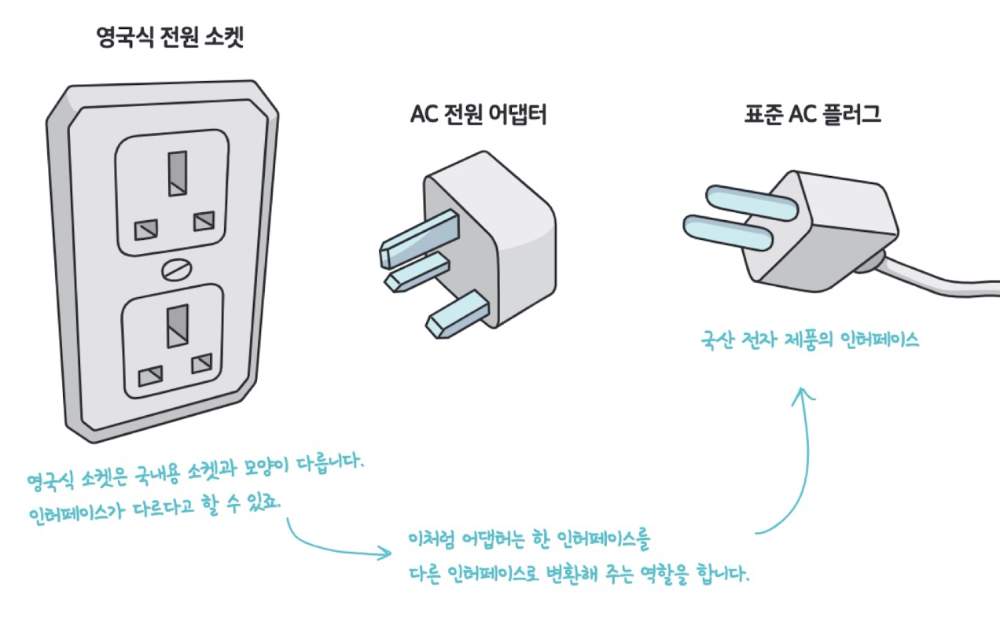
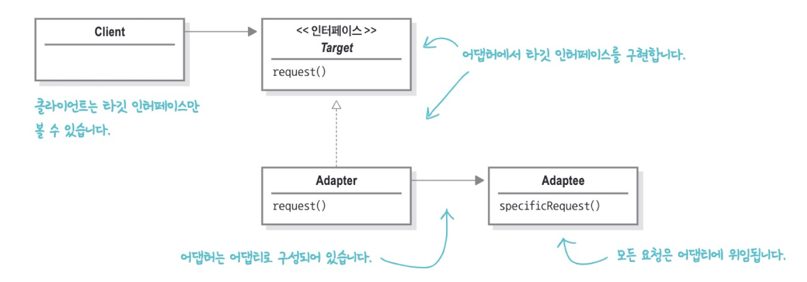

# 어댑터 패턴(Adapter Pattern)



***휴대폰 어댑터***

우리 주변에 있는 어댑터를 이해한다면 어댑터 패턴의 이해는 어렵지 않다. 한국에서 사용하던 휴대전화 충전기를 영국에서도 사용하려면 110v에 맞는 돼지코를 끼워야하는데, 이 돼지코가 바로 어댑터이다. 즉 **어댑터는 소켓의 인터페이스를 플러그에서 필요로하는 인터페이스로 바꿔준다**고 할 수 있다.


## 예시 코드

### 1. 오리와 칠면조 (_01_before)

```java
public interface Duck {
    void quack();
    void fly();
}
```

***Duck.java***

```java
public class MallardDuck implements Duck {
    @Override
    public void quack() {
        System.out.println("꽥");
    }

    @Override
    public void fly() {
        System.out.println("날고 있어요!");
    }
}
```

***MallardDuck.java***

```java
public interface Turkey {
    void gooble();
    void fly();
}
```

***Turkey.java***

```java
public class WildTurkey implements Turkey {
    @Override
    public void gooble() {
        System.out.println("골골");
    }

    @Override
    public void fly() {
        System.out.println("짧은 거리를 날고 있어요!");
    }
}
```

***WildTurkey.java***

동물원에 `Duck` 객체가 모자라서 `Turkey` 객체를 대신 사용해야하는 상황이라고 가정해보자. 물론 인터페이스가 다르기 때문에 `Turkey` 객체를 바로 사용할 수 없다. **어댑터**를 만들어보자.


> 
>
> ***어댑터 패턴의 클래스다이어그램***
>
> 어떤 **인터페이스(Adaptee)**를 클라이언트(Client)에서 **요구하는 형태(Target)**로 적응시키는 **역할(Adapter)**을 한다.  
>
> 어댑터 패턴은 여러 객체 지향 원칙을 반영하고 있다. 어댑티를 새로 바뀐 인터페이스로 감쌀 때는 객체 구성을 이용한다. 어댑티의 모든 서브클래스에 어댑터를 쓸 수 있는 장점이 있다. 그리고 이 패턴은 클라이언트를 특정 구현이 아닌 인터페이스에 연결한다. 서로 다른 백엔드 클래스로 변환시키는 여러 어댑터를 사용할 수도 있다.


### 2. 칠면조 어댑터 (_02_adapter_pattern_01)

```java
public class TurkeyAdapter implements Duck {
    private final Turkey turkey;

    public TurkeyAdapter(Turkey turkey) {
        this.turkey = turkey;
    }

    @Override
    public void quack() {
        turkey.gooble();
    }

    @Override
    public void fly() {
        IntStream.range(0, 5)
                .forEach((i) -> turkey.fly());
    }
}
```

***TurkeyAdapter.java***

> 1: 적응 시킬 인터페이스인 `Duck`을 구현한다. 다시말해 클라이언트가 원하는 인터페이스를 구현해야한다.
>
> 4: 기존 형식 객체의 레퍼런스를 받아온다.
>
> 9: 인터페이스에 들어있는 모든 메서드를 구현하고, `adaptee`인 `Turkey`의 메소드를 호출한다.


```java
public static void main(String[] args) {
    Duck duck = new MallardDuck();
    Turkey turkey = new WildTurkey();
    Duck turkeyAdapter = new TurkeyAdapter(turkey);

    System.out.println("칠면조가 말하길");
    turkey.gooble();
    turkey.fly();

    System.out.println("\n오리가 말하길");
    testDuck(duck);

    System.out.println("\n칠면조 어댑터가 말하길");
    testDuck(turkeyAdapter);
}

private static void testDuck(Duck duck) {
    duck.quack();
    duck.fly();
}
```

***TurkeyAdapter.java 테스트 코드***

> 5: `Turkey` 객체를 `TurkeyAdapter`로 감싸서 `Duck`처럼 보이게 한다.
>
> 15: 오리 대신 칠면조를 넘길 수 있게 되었다.


이 코드에서 클라이언트는 어댑터를 다음과 같이 사용하게 된다.

1. 클라잉너트에서 타겟 인터페이스로 메소드를 호출해 어댑터에 요청을 보낸다.
2. 어댑터는 어댑티 인터페이스로 그 요청을 어댑티에 관한 하나 이상의 메소드 호출로 변환한다.
3. 클라이언트는 호출 결과를 받긴 하지만 중간에 어댑터가 있다는 사실을 모른다.

> **"클라이언트와 어댑티는 서로 분리되어 있다."**


## 사용 예시

### 자바에서의 어댑터 패턴

**List**

```java
List<String> strings = Arrays.asList("a", "b", "C");
```

**Enumeration**

```java
Enumeration<String> enumeration = Collections.enumeration(strings);
```


## 장/단점

### 장점 

- 기존 코드(Adaptee)를 변경하지 않고 원하는 인터페이스 구현체를 만들어 재사용할 수 있다.
- 기존 코드가 하던 일과 특정 인터페이스 구현체로 변환하는 작업을 각기 다른 클래스로 분리하여 관리할 수 있다.

### 단점

- 새 클래스가 생겨 복잡도가 증가할 수 있다. 