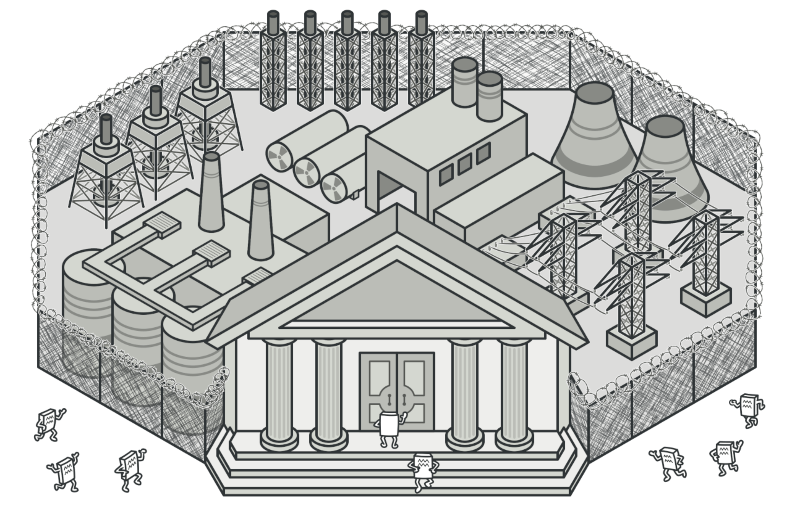
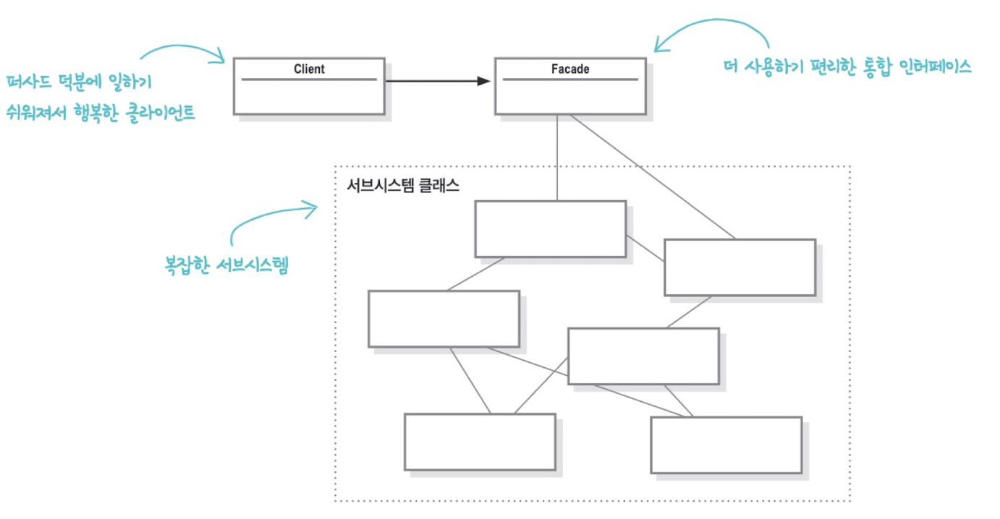
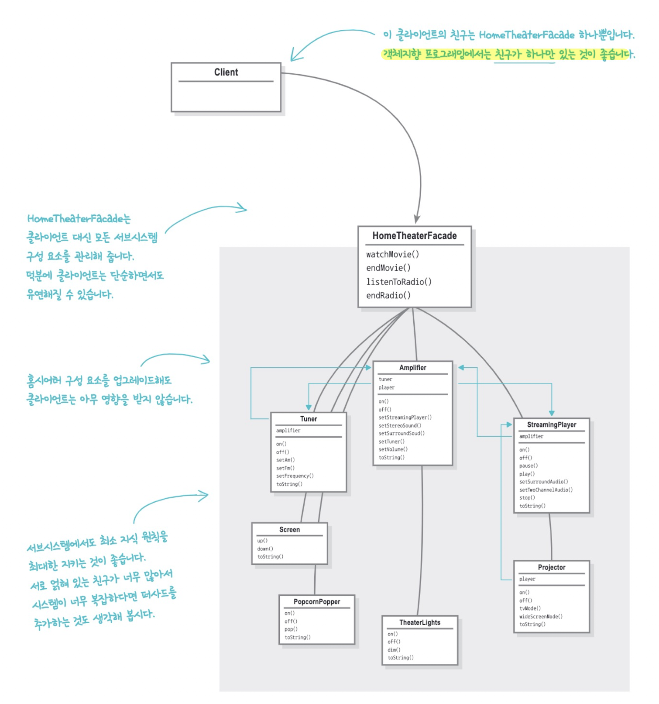

# 퍼사드 패턴(Facade Pattern)



***퍼사드 패턴***

인터페이스를 단순하게 바꾸려고 인터페이스를 변경하는 패턴이다. 하나 이상의 클래스 인터페이스를 깔끔하면서도 효과적인 퍼사드로 덮어준다.

> **퍼사드**
>
> 겉모양이나 외관이라는 뜻


## 실습 코드

### 1. 많은 가전 제품 다루기 (_01_before)


넷플릭스, 티빙, 애플티비 등 많은 OTT(Over The Top media service)가 많아졌다. 모든 컨텐츠를 다 즐기기위해 홈시어터를 구축해보자. 


***홈시어터를 위한 시스템 ERD***

우리가 원하는 것은 스트리밍 플레이어, 프로젝터, 자동스크린, 서라운드 음향은 물론 팝콘 기계까지 갖춘 시스템이다.


```java
// 영화 보기
popper.on();
popper.pop();
lights.dim(10);
screen.down();
projector.on();
projector.wideScreenMode();
amp.on();
amp.setStreamingPlayer(player);
amp.setSurroundSound();
amp.setVolume(5);
player.on();
player.play("Raiders of the Lost Ark");
```

***영화 보는 과정***

이제 영화를 보려면 위와 같은 과정을 다 외워서 진행해야한다.


```java
// 영화 끄기
System.out.println("Shutting movie theater down...");
popper.off();
lights.on();
screen.up();
projector.off();
amp.off();
player.stop();
player.off();
```

***영화 끄는 과정***

다 보고 끄는 것도 일이다. 홈 시어터 사용법이 너무 복잡하다. 이를 퍼사드 패턴으로 간단하게 처리해보자.


> **디자인 원칙. 최소 지식 원칙 (디미터의 법칙)**
>
> 진짜 절친에게만 이야기해야한다.

퍼사드 원칙을 알아보기 전에 새로운 디자인 원칙이 추가된다. 객체 사이의 상호작용은 될 수 있으면 아주 가까운 친구 사이에서만 허용하는 편이 좋다. 시스템을 디자인할 때 어떤 객체든 그 객체와 상호작용을 하는 클래스의 개수와 상호작용 방식에 주의를 기울여야 한다는 뜻이다.

이 원칙을 따르면 여러 클래스가 복잡하게 얽혀 있어서 시스템의 한 부분을 변경했을 때 다른 부분까지 줄줄이 고쳐야하는 상황을 미리 방지할 수 있다.

> **리팩토링 책. 메소드 체이닝의 냄새**
>
> - person.getDepartment().getManager()
>
> - person.getManager()
>
> 🗣 종민 : 물어보지 말고 시켜라.


> ***퍼사드 패턴***
>
> 서브시스템에 있는 일련의 인터페이스를 통합 인터페이스로 묶어준다. 또한 고수준 인터페이스도 정의하므로 서브시스템을 더 편리하게 사용할 수 있다.

퍼사드 패턴은 최소 지식 원칙을 따르는 패턴이라고 볼 수 있다. 클라이언트와 서브 시스템이 서로 긴밀하게 연결되지 않고, 퍼사드만 알게된다.




***최소 지식 원칙을 준수하게하는 퍼사드 패턴***


### 2. 퍼사드로 한번에 다루기 (_02_facade_pattern)

```java
public class HomeTheaterFacade {
  
	 // 가전 제품 필드와 생성자 생략
 
   public void watchMovie(String movie) {
      System.out.println("Get ready to watch a movie...");
      popper.on();
      popper.pop();
      lights.dim(10);
      screen.down();
      projector.on();
      projector.wideScreenMode();
      amp.on();
      amp.setStreamingPlayer(player);
      amp.setSurroundSound();
      amp.setVolume(5);
      player.on();
      player.play(movie);
   }
 
 
   public void endMovie() {
      System.out.println("Shutting movie theater down...");
      popper.off();
      lights.on();
      screen.up();
      projector.off();
      amp.off();
      player.stop();
      player.off();
   }
}
```

***HomeTheaterFacade.java***

우선 퍼사드에서 서브시스템에 있는 모든 구성요소에 접근할 수 있도록 구성하자.


```java
HomeTheaterFacade homeTheater =
      new HomeTheaterFacade(amp, tuner, player,
            projector, screen, lights, popper);

homeTheater.watchMovie("Raiders of the Lost Ark");
homeTheater.endMovie();
```

***퍼사드 사용 예시***

> 2: 서브시스템에 들어가는 모든 구성 요소를 매개 변수로 전달해서 퍼사드 인스턴스 생성
>
> 5: 단순화된 인터페이스를 써서 영화를 키고 끈다. 

이제 클라이언트는 홈시어터의 자세한 로직을 몰라도 되고, 절친인 퍼사드와만 얘기할 수 있게 되었다.


## 사용 예시

### 자바에서의 퍼사드 패턴

**MailSender**

```java
MailSender mailSender = new JavaMailSenderImpl();
```

자바에서 메일 보내는 서브 시스템을 모두 추상화 시켰다.

### 스프링에서의 퍼사드 패턴

**PlatformTransactionManager**

```java
PlatformTransactionManager manager = new JdbcTransactionManager();
```

> 🗣 종민, 지현 
>
> : 파사드의 대표적인 예는 Slf4j Logger 이다. Log4J, LogBack 같은 복잡한 구현체를 추상화해준다. 마이크로미터...


## 장/단점

- 장점
  - 서브시스템 의존성을 몰아줄 수 있다.
  - 클라이언트에서 서브시스템의 모든 구현을 알 필요 없다.
- 단점
  - 퍼사드 자체가 모든 의존성을 가지게 된다.