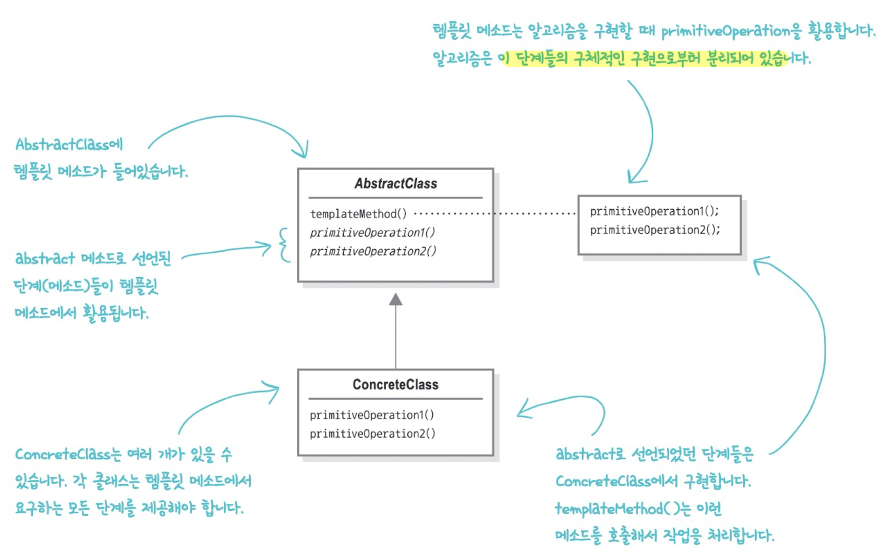

# 템플릿 메서드 패턴(Template Method Pattern)


템플릿 메서드는 상위 클래스에서 알고리즘의 골격을 정의하지만 하위 클래스가 구조를 변경하지 않고 알고리즘의 특정 단계를 재정의할 수 있도록 하는 동작 디자인 패턴입니다.


## 실습 코드

### 1. 비슷한 동작을 하는 클래스 (_01_before)

스타벅스의 홍차와 커피의 만드는법은 굉장히 유사하다. 

1. 물을 끓인다.
2. 끓는 물에 (커피/홍차)를 우려낸다.
3. (커피/홍차)를 컵에 따른다.
4. 첨가물을 추가한다.


이를 코드로 나타내보면 다음과 같다.

```java
public class Coffee {
    
    void prepareRecipe() {
        boilWater();
        brewCoffeeGrinds();
        pourInCup();
        addSugarAndMilk();
    }

    private void boilWater() {
        System.out.println("물 끓이는 중");
    }

    private void brewCoffeeGrinds() {
        System.out.println("필터로 커피를 우려내는 중");
    }

    private void pourInCup() {
        System.out.println("컵에 따르는 중");
    }

    private void addSugarAndMilk() {
        System.out.println("설탕과 우유를 추가하는 중");
    }
}
```

_**Coffee.java**_

```java
public class Tea {
    
    void prepareRecipe() {
        boilWater();
        steepTeaBag();
        pourInCup();
        addLemon();
    }

    private void boilWater() {
        System.out.println("물 끓이는 중");
    }
    
    private void steepTeaBag() {
        System.out.println("찻잎을 우려내는 중");
        
    }

    private void pourInCup() {
        System.out.println("컵에 따르는중");
    }

    private void addLemon() {
        System.out.println("레몬을 추가하는 중");
    }
}
```

_**Tea.java**_

아니나 다를까 `boilWater()`와 `pourInCup()`은 두 클래스에 중복되어있고, 나머지 두 메소드도 이름만 다를 뿐 비슷한 작업을 하고 있다. 지금까지 배운대로라면 코드가 중복된다면 디자인 수정을 고려해야한다. 두 클래스의 공통된 부분을 추상화 해서 베이스 클래스로 빼보면 어떨까? 


### 2. 공통 부분 추상화하기 (_02_abstract)

```java
public abstract class CaffeineBeverage {
    
    abstract void prepareRecipe();

    protected void boilWater() {
        System.out.println("물 끓이는 중");
    }

    protected void pourInCup() {
        System.out.println("컵에 따르는중");
    }
}
```

_**CaffeineBeverage.java**_

```java
public class Coffee extends CaffeineBeverage {

    void prepareRecipe() {
        boilWater();
        brewCoffeeGrinds();
        pourInCup();
        addSugarAndMik();
    }

    private void brewCoffeeGrinds() {
        System.out.println("필터로 커피를 우려내는 중");
    }

    private void addSugarAndMik() {
        System.out.println("설탕과 우유를 추가하는 중");
    }
}
```

_**Coffee.java**_

```java
public class Tea extends CaffeineBeverage {

    void prepareRecipe() {
        boilWater();
        steepTeaBag();
        pourInCup();
        addLemon();
    }

    private void steepTeaBag() {
        System.out.println("찻잎을 우려내는 중");

    }

    private void addLemon() {
        System.out.println("레몬을 추가하는 중");
    }
}
```

_**Tea.java**_

`prepareRecipe()`는 서브클래스마다 다르기에 추상 메소드로 선언하고, `boilWater()`와 `pourInCup()` 메소드는 공통으로 사용되므로 슈퍼 클래스에 정의한다.

이게 다 추상화 한 것일까? **2. 우려내기 작업**과 **4. 첨가물 추가 작업**은 메소드 이름은 다르지만 사실상 동일 동작을 수행한다. 


### 3. 템플릿 메소드 패턴 적용 (_03_template_method_pattern)

```java
public abstract class CaffeineBeverage {

    void prepareRecipe() {
        boilWater();
        brew();
        pourInCup();
        addCondiments();
    }

    protected void boilWater() {
        System.out.println("물 끓이는 중");
    }
    
    protected abstract void brew();

    protected void pourInCup() {
        System.out.println("컵에 따르는중");
    }

    protected abstract void addCondiments();
}
```

_**CaffeineBeverage.java**_

```java
public class Coffee extends CaffeineBeverage{

    protected void brew() {
        System.out.println("필터로 커피를 우려내는 중");
    }

    protected void addCondiments() {
        System.out.println("설탕과 우유를 추가하는 중");
    }
}
```

_**Coffee.java**_

```java
public class Tea extends CaffeineBeverage {

    protected void brew() {
        System.out.println("찻잎을 우려내는 중");

    }

    protected void addCondiments() {
        System.out.println("레몬을 추가하는 중");
    }
}
```

_**Tea.java**_
우려낸다와 첨가물을 넣는다는 메소드를 `brew()`, `addCondiments()`로 각각 재정의하게 되면 `prepareRecipe()`를 슈퍼클래스로 옮길 수 있다. 조금 다른 방식으로 구현해야 하는 부분이 있긴하지만 만드는 방법이 사실상 똑같으므로 제조법을 일반화해서 베이스 클래스에 넣었다.

`prepareRecipe()`가 바로 템플릿 메소드다. 이 코드는 다음의 장점을 가진다:

1. `CaffeineBeverage`에서 알고리즘을 독점한다.
2. `CaffeineBeverage` 덕분에 서브클래스에서 코드를 재사용할 수 있다.
3. 알고리즘이 한 군데에 모여 있으므로 한 부분만 고치면 된다.
4. 다른 음료도 쉽게 추가할 수 있다.
5. 알고리즘의 지식은 `CaffeineBeverage`에 몰려있고, 일부 구현만 서브 클래스에 의존한다.

> 
>
> ***템플릿 메소드 패턴***
>
> 알고리즘의 골격을 정의한다. 템플릿 메소드를 사용하면 알고리즘의 일부 단계를 서브클래스에서 구현할 수 있으며, 알고리즘의 구조는 그대로 유지하면서 알고리즘의 특정 단계를 서브클래스에서 재정의할 수 있다.


위의 템플릿 메소드를 사용하면 할리우드 원칙을 지킬 수 있다.

> ***디자인 원칙. 할리우드 원칙***
>
> 먼저 연락하지 마세요. 저희가 연락 드리겠습니다.

할리우드 원칙을 활용하면 `의존성 부패(dependency rot)`를 방지할 수 있다. 어떤 고수준 요소가 저수준 요소에 의존하고 다시 저수준 요소는 고수준 요소에 의존하고 다시 또 다시 의존하는 식으로 의존성이 복잡하게 꼬여있는 상황을 의존성이 부패했다고 한다. 이렇게 되면 시스템 디자인을 아무도 알아볼 수 없다. 할리우드 원칙을 사용하면, 저수준 구성 요소가 시스템에 접속할 수는 있지만 언제, 어떻게 그 구성 요소를 사용할지는 고수준 구성 요소가 결정할 수 있다.


### 4. 후크 사용하기 (_04_hook)

알고리즘의 특정 단계가 서브클래스에서 무조건 제공되어야한다면 위에 예제에선 `abatract` 메소드로 선언해서 구현하도록 했다. 그럼 특정 단계가 서브클래스별로 선택적으로 적용된다면 어떤 방식으로 하면 될까?


```java
public abstract class CaffeineBeverageWithHook {

    final void prepareRecipe() {
        boilWater();
        brew();
        pourInCup();
        if (customerWantscondiments()) {
            addCondiments();
        }
    }

    private void boilWater() {
        System.out.println("물 끓이는 중");
    }

    protected abstract void brew();

    private void pourInCup() {
        System.out.println("컵에 따르는중");
    }

    protected abstract void addCondiments();

    protected boolean customerWantscondiments() {
        return true;
    }
}
```

***CaffeineBeverageWithHook.java***

```java
public class CoffeeWithHook extends CaffeineBeverageWithHook {

    protected void brew() {
        System.out.println("필터로 커피를 우려내는 중");
    }

    protected void addCondiments() {
        System.out.println("설탕과 우유를 추가하는 중");
    }

    protected boolean customerWantscondiments() {
        String answer = getUserInput();

        if (answer.toLowerCase().startsWith("y")) {
            return true;
        } else {
            return false;
        }
    }

    private String getUserInput() {
        String answer = null;

        System.out.print("커피에 우유와 설탕을 넣을까요? (y/n)");

        BufferedReader in = new BufferedReader(new InputStreamReader(System.in));
        try {
            answer = in.readLine();
        } catch (IOException e) {
            throw new RuntimeException("io 오류");
        }
        if (answer == null) {
            return "no";
        }
        return answer;
    }
}
```

***CoffeeWithHook.java***

```java
CoffeeWithHook coffeeHook = new CoffeeWithHook();
coffeeHook.prepareRecipe();
```

***실행 코드***

```
커피 준비 중...
물 끓이는 중
필터로 커피를 우려내는 중
컵에 따르는중
커피에 우유와 설탕을 넣을까요? (y/n)y
설탕과 우유를 추가하는 중
```

***결과***

`CaffeineBeverageWithHook`의 `customerWantscondiments()` 메소드가 바로 그 예다. 추상 클래스에서 선언되지만 기본적인 내용만 구현되어 있거나 아무 코드도 들어있지 않는 메소드를 통해서 서브 클래스가 무시하고 넘어가거나 다양한 위치에서 알고리즘에 끼어들 수 있게한다. 이를 `후크`이라고 한다.


## 사용 예시

### 자바에서 템플릿 메서드

**Arrays.sort**

`Arrays.sort`는 내부적으로 배열을 복사한 후 `mergeSort()`, `swap()` 등등의 알고리즘을 수행한다. 

템플릿 메소드는 알고리즘을 구현하고 일부 단계는 서브클래스에서 구현한 것을 써서 처리한다고 했다. 하지만 자바의 배열은 서브 클래스를 만들 수 없었고, 어떤 배열에서도 정렬 기능을 사용할 수 있도록 만들어야했다. 그래서 정적 메소드를 정의한 후 대소 비교 부분은 정렬될 객체에서 구현하도록 만들었다. 온전한 템플릿 메소드라고 할 순 없지만 `sort()` 메소드 구현 자체는 템플릿 메소드 패턴의 기본 정신을 충실히 따르고 있다.

마치 전략 패턴처럼 보일 수 있다. 하지만 전략 패턴은 구성할 때 사용하는 클래스에서 알고리즘을 완전히 구현한다. Arrays 클래스에서 사용하는 알고리즘은 불완전하고, `compareTo()`를 구현한 다른 클래스에서 제공하므로 오히려 배열 코드에는 템플릿 메소드 패턴이 적용되었다고 볼 수 있다.

**AbstractList**

```java
public class MyStringList extends AbstractList<String> {
  private String[] myList;
  
  MyStringList(String[] strings) {
    myList = strings;
  }
  
  public String get(int index) {
    return myList[index];
  }
  
  public int size() {
    return myList.length;
  }
  
  public String set(int index, String item) {
    String oldString = myList[index];
    myList[index] = item;
    return oldString;
  }
}
```

***AbstractList를 확장한 커스텀 리스트***

`ArrayList`, `LinkedList` 같은 자바의 리스트 컬렉션은 리스트에서 필요한 기능을 구현해주는 `AbstractList` 클래스를 확장한다. 해당 클래스의 추상 메소드인 `get()`, `size()`만 구현하면 기본적인 기능은 모두 받아올 수 있다.

```java
MyStringList duckList = new MyStringList(ducks);
List ducksSubList = ducksList.subList(2, 3);
```

***커스텀 리스트 사용***

사용 예를 보면 `AbstractList`에 구현되어있는 서브 배열을 만드는 `subList` 템플릿 메소드를 사용할 수 있게 된다.


## 장/단점

### 장점

- 클라이언트가 대규모 알고리즘의 특정 부분만 재정의하도록 하여 알고리즘의 다른 부분에 발생하는 변경 사항의 영향을 덜 받도록 할 수 있다.

- 중복 코드를 슈퍼 클래스로 가져올 수 있다.

### 단점

- 일부 클라이언트는 알고리즘의 제공된 골격에 의해 제한될 수 있다.

> 🗣 종민 : `JDBCTemplate`이 대표적인 예다. 템플릿 콜백 패턴도 포함되어있다. 참고하시려면 이 [링크](https://velog.io/@heoseungyeon/JdbcTemplatefeat.%ED%85%9C%ED%94%8C%EB%A6%BF-%EC%BD%9C%EB%B0%B1-%ED%8C%A8%ED%84%B4)를 클릭하세요.

