# 09. 반복자 패턴과 컴포지트 패턴

## 01. 반복자 패턴

> 반복자 패턴은 컬렉션의 구현 방법을 노출하지 않으면서 집합체 내의 모든 항목에 접근하는 ㅂ방법을 제공합니다. 
> 또한, 각 항목에 일일이 접근하는 기능을 집합체가 아닌 반복자 객체가 책임진다는 장점도 있습니다.


### 1) 관리하기 힘든 종업원 코드

아침에는 팬케이크 하우스메뉴, 점심에는 객체마을 식당 메뉴 사용하기


문제점 : 메뉴항목을 구현하는 방법은 이미 합의가 되었는데 어떻게 아침메뉴와 점심메뉴를 다르게 할까? (각각 ArrayList, 배열로 구현되어 있음)


팬케이크 하우스 -> 추가를 쉽게 하기 위해 ArrayList로 구현

객체마을 식당 -> 최대 객체 개수를 정해놓기 위해 배열로 구현


종업원의 자격 요건

- printMenu()
- printBreackfastMenu()
- printLunchMenu()
- printVegetarianMenu()
- isItemVegetarian(name)


print를 하게 되면 다음과 같이 for 문이 여러개 생기는 문제점이 발생함

(다른 가게와 합병한다면 for문이 하나씩 더 추가됨)

```java
for (int i = 0; i < breakfastItems.size(); i++) {
   MenuItem menuItem = breakfastItems.get(i);
   System.out.println(menuItem.getName() + " ");
   System.out.println(menuItem.getPrice() + " ");
   System.out.println(menuItem.getDescription());
}

for (int i = 0; i < lunchItems.length; i++) {
   MenuItem menuItem = lunchItems[i];
   System.out.println(menuItem.getName() + " ");
   System.out.println(menuItem.getPrice() + " ");
   System.out.println(menuItem.getDescription());
}
```

- 관리하기 힘든 종업원 코드

  - 메뉴 구현법이 캡슐화 되어 있지 않음.
  - MenuItems 대상으로 반복 작업을 하려면 2개의 순환문이 필요
  - 종업원이 구상 클래스(MenuItem[]과 ArrayList)에 직접 연결되어 있음
  - 유사한 인터페이스를 가졌음에도 2개의 서로 다른 구상 메뉴 클래스에 묶여 있음

  

### 2) Iterator

각각 배열을 순회하는 공통 인터페이스를 구현하여 print할 수 있도록 변경

Iterator를 implements 하여서 외부에서 iterator.next()를 호출

- Iterator를 적용하여 변경된 점
  - 메뉴 구현법이 캡슐화 되어 있음
  - 반복자만 구현한다면 다형성을 활용하여 어떤 컬렉션이든 1개의 순환문으로 처리할 수 있음
  - 종업원은 인터페이스(Iterator)만 알면 됨
  - Menu 인터페이스가 통일되진 않음

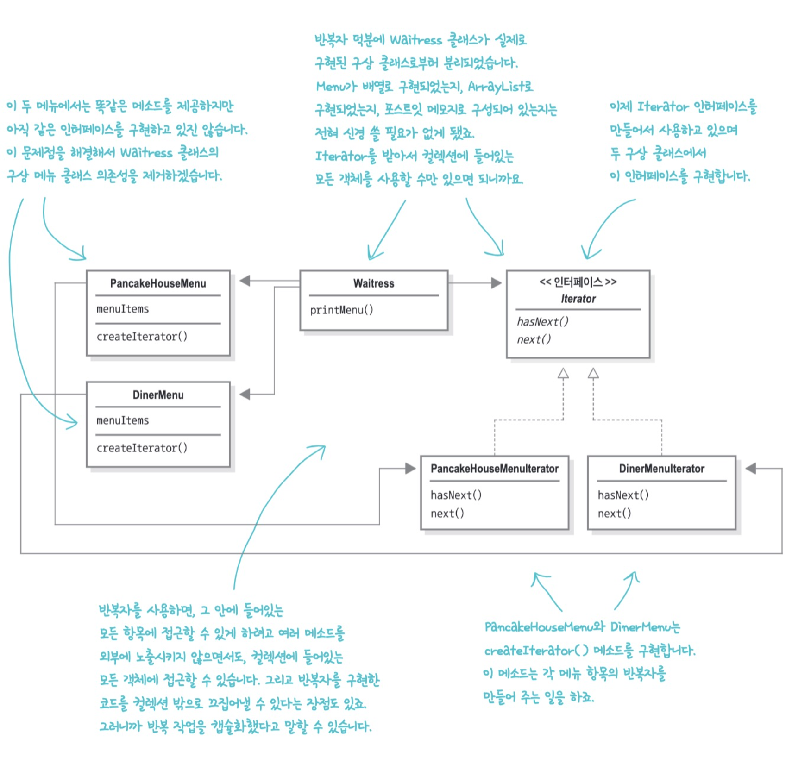

- 객체 컬렉션에서 어떤 항목을 제거하는 기능을 제공하고 싶지 않을때는?
  - 실행 중에 java.lang.UnsupportedOperationException을 던지도록 함
- 멀티스레드를 사용할 때 같은 객체 컬렉션에 여러 반복자가 있다면 remove는 어떤 식으로 작동하나요?
  - 반복자를 써서 컬렉션에 있는 각 항목을 접근하고 있는 상화에서 컬렉션이 변경될 때를 대비한 remove()행동은 정의되어 있지 않다. 따라서 컬렉션에 동시에 접근하는 멀티스레드 코드를 디자인할 때는 매우 조심해야 한다.


### 3) java.util.Iterator 사용하기


java.util.Iterator 인터페이스

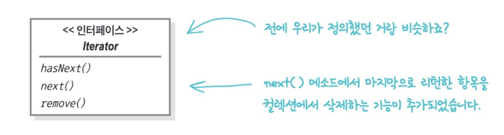


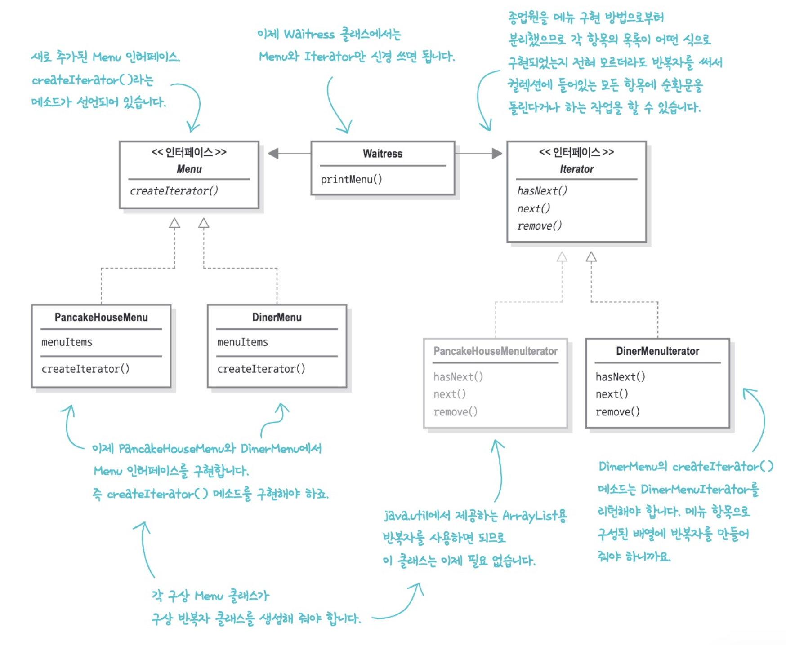

### 4) 반복자 패턴의 구조 알아보기

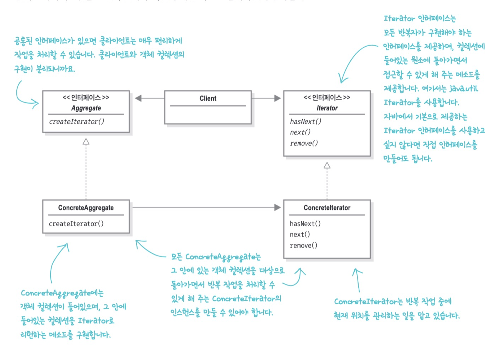

### 5) 단일 역할 원칙

- 집합체에서 내부 컬렉션 관련 기능과 반복자용 메서드 관련 기능을 전부 구현한다면?
  - 컬렉션이 어떤 이유로 바뀌게 되면 그 클래스도 바뀌어야 함
  - 반복자 관련 기능이 바뀌었을때도 클래스가 바뀌어야 함.


> 디자인원칙
> 어떤 클래스가 바뀌는 이유는 하나뿐이어야 한다.


응집도) 한 클래스 또는 모듈이 특정 목적이나 역할을 얼마나 일관되게 지원하는지를 나타내는 척도


Q : 내부 반복자와 외부 반복자?

A : 우리는 외부 반복자 사용. 내부 반복자는 반복자 자신이 반복 작업을 제어하기 때문에 마음대로 제어할 수 없음

Q : 해시 테이블 같이 정해진 순서가 없는 컬렉션의 반복 작업 순서는?

A : 반복자에는 특별한 순서가 정해져 있지 않고 컬렉션의 특성 및 구현에 따라 접근 순서가 정해진다.

Q : Enumeration 인터페이스에서도 반복자 패턴을 사용하는가?

A : 예전에 Enumeration은 Iterator 용도로 쓰였음. 하지만 Iterator를 지원하는 자바 클래스가 더 많기 때문에 대부분은 Iterator 사용. Enumeration <-> Iterator 변환이 필요하다면 어댑터 패턴 적용하기


### 6) Iterable 인터페이스 알아보기

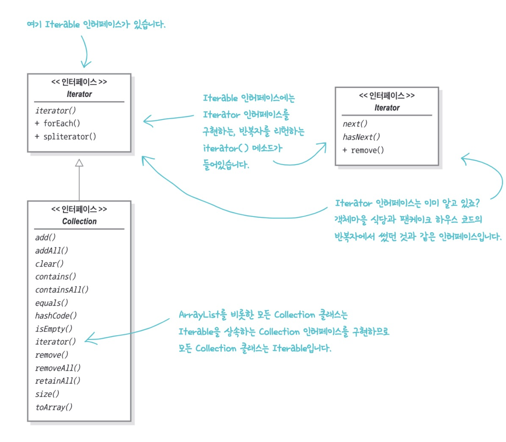

어떤 클래스에서 Iterable을 구현한다면 그 클래스는 iterator() 메소드 구현

그 메소드는 Iterator 인터페이스를 구현하는 반복자를 리턴

컬렉션에 있는 항목을 대상으로 반복 작업을 수행하는 방법을 제공하는 forEach() 메소드가 기본으로 포함되며 향상된 for문으로 편리한 문법적 기능 제공


### 7) 반복자와 컬렉션

- 컬렉션 프레임워크 : 클래스와 인터페이스를 모아놓음
- 컬렉션과 반복자를 사용하면 모든 컬렉션 객체에서 자신을 대상으로 하는 반복자를 리턴할 줄 안다는 장점을 활용할 수 있음

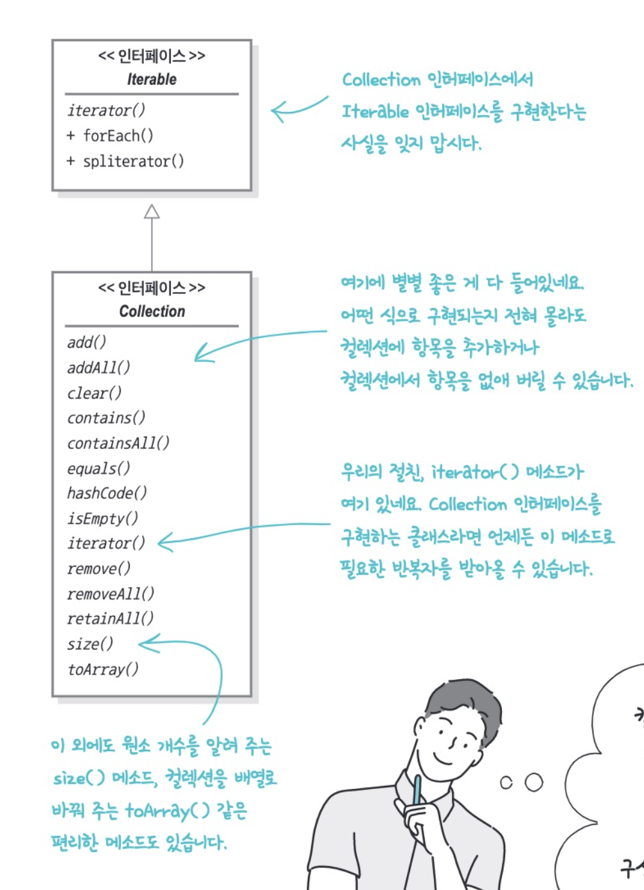


### 8) 종업원 코드 개선하기

```java
public class Waitress {
	List<Menu> menus; // List 이용하기

  public Waitress(List<Menu> menus) {
    this.menus = menus;
  }
  ...
}
```


## 02. 컴포지트 패턴

> 객체를 트리구조로 구성해서 부분-전체 계층구조를 구현
> 컴포지트 패턴을 사용하면 클라이언트에서 개별 객체와 복합 객체를 똑같은 방법으로 다룰 수 있음

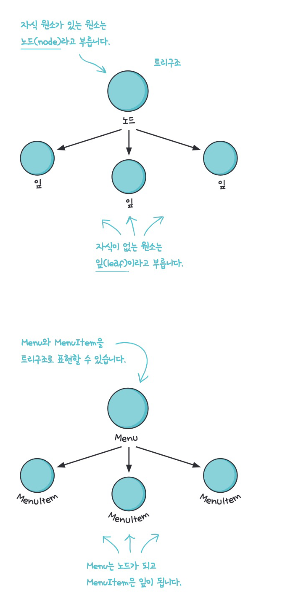

메뉴와 항목을 같은 구조에 넣어서 부분-전체 계층구조를 생성할 수 있음

- 부분 전체 계층 구조란

  부분(메뉴, 메뉴 항목)들이 계층을 이루고 있지만 모든 부분을 묶어서 전체로 다룰 수 있는 구조

  -> 각 메뉴 안에 또 다른 메뉴(서브 메뉴)와 메뉴 항목이 들어갈 수 있음

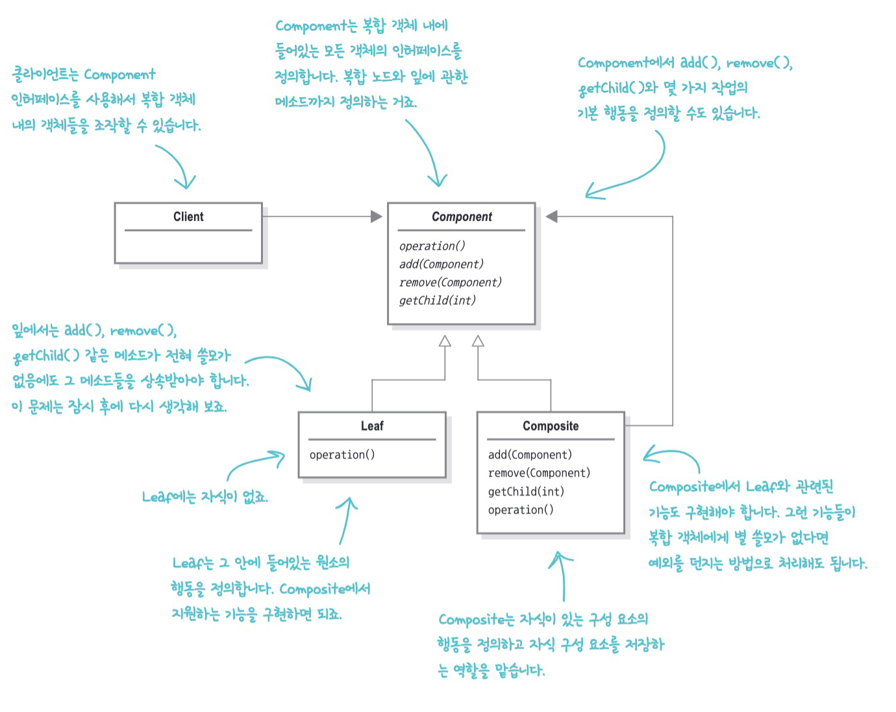

### 1) 디저트 서브메뉴 추가하기

- 메뉴, 서브메뉴, 메뉴 항목 등을 모두 넣을 수 있는 트리 형태의 구조가 필요
- 각 메뉴에 있는 모든 항목을 대상으로 특정 작업을 할 수 있는 방법을 제공해야 하며 그 방법은 적어도 지금 사용 중인 반복자만큼 편리해야 함
- 더 유연한 방법으로 아이템을 대상으로 반복 작업을 수행할 수 있어야 함

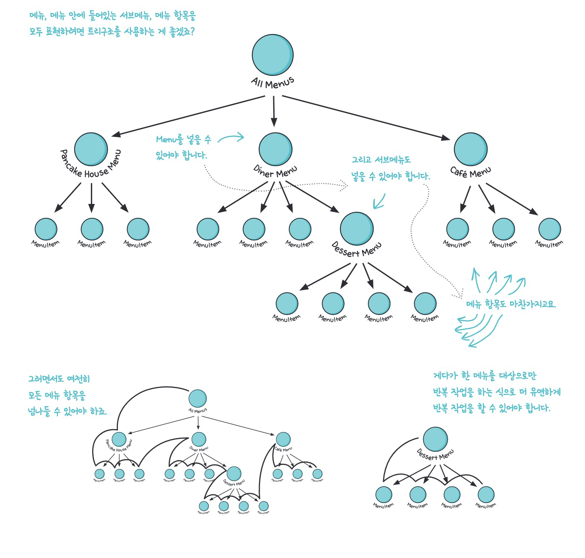

### 2) 컴포지트 패턴으로 메뉴 디자인 하기

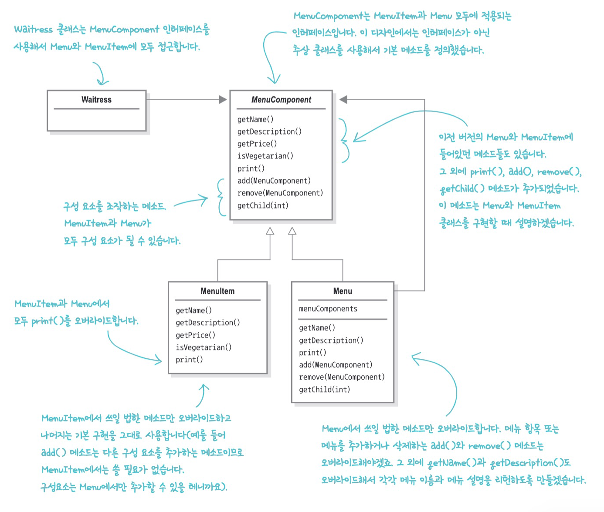

```java
public class Menu extends MenuComponent {
	  ...
    public void print() {
      
      System.out.print("\n" + getName());
			System.out.println(", " + getDescription());
			System.out.println("---------------------");
      
      // 이렇게만 하면 복합 객체에 관한 내용은 출력하지 않음
      

			for (MenuComponent menuComponent : menuComponents) {
				menuComponent.print();
			}
      // 재귀적으로 호출하기
		}
}
```

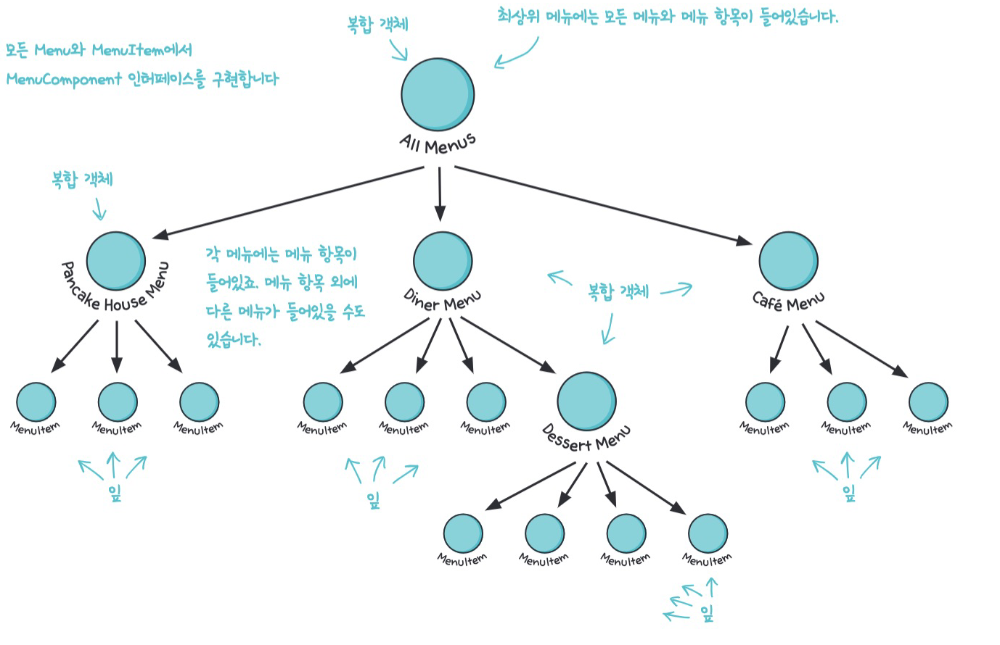

컴포지트 패턴은 단일 책임 원칙을 위반하는 대신 투명성을 확보한다

- 컴포지트 패턴이 하는 일

  - 계층 구조를 관리하는 일

  - 메뉴 관련 작업을 처리하는 일

- 투명성

  - Component 인터페이스에 자식들을 관리하는 기능과 잎으로써의 기능을 전부 넣어서 클라이언트가 복합 객체와 잎을 똑같은 방식으로 처리할 수 있도록 만들 수 있음
  - 어떤 원소가 복합객체인지 잎인지 투명하게 보임

  

>  **상황에 따라 원칙을 적절하게 사용해야 함**


Q. 모든 객체의 인터페이스가 똑같아야 하는데 복합 객체 내에 다른 일을 하는 객체가 들어있으면?

A. 클라이언트에서 봤을 때 투명하게 작동하려면 복합 객체 내의 모든 인터페이스가 동일해야 함. 하지만 객체에 따라 아무 의미 없는 메서드가 생길 수도 있다. 이런 메서드는 아무것도 하지 않거나 null, false 를 상황에 맞게 리턴하거나 예외를 던진다(클라이언트에서 예외를 적절히 처리)

Q. 클라이언트가 어떤 형식의 객체를 다룰지 미리 알 수 없다면 어떤 메서드를 호출하면 안되는지 어떻게 알까?

A. 메소드 구조를 잘 조절해서 기본 구현으로 그럴듯한 행동을 만들 수 있음. 예를 들어 클라이언트가 getChild()를 호출하면, 잎 객체는 조금 이상하다고 느낄 수 있지만, 자식이 하나도 없는 객체에 불과하다고 보면 된다.

Q. 어떤 클라이언트는 이 문제로 서로 다른 객체에 서로 다른 인터페이스를 요구해서 엉뚱한 메소드가 호출되지 않게 하는데 이것도 컴포지트 패턴인가?

A. 훨씬 안전한 버전의 컴포지트 패턴이다. 하지만 그러려면 객체를 올바르게 캐스팅할 수 있도록 메소드를 호출하기 전에 객체 형식을 매번 확인해야 한다.

Q. 더 고려해야할 점은?

A. 자식의 순서도 고려해야 함. 복합 구조가 너무 복잡하거나 전체를 도는데 너무 많은 자원이 필요하다면 복합 노드를 캐싱해두면 도움이 된다.

Q. 가장 큰 장점은?

A. 클라이언트를 단순화시킬 수 있다.

