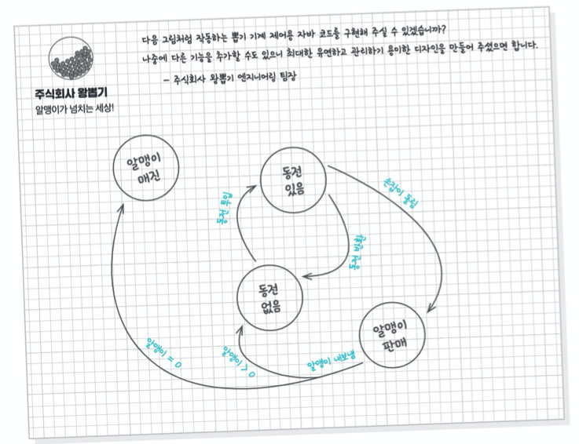
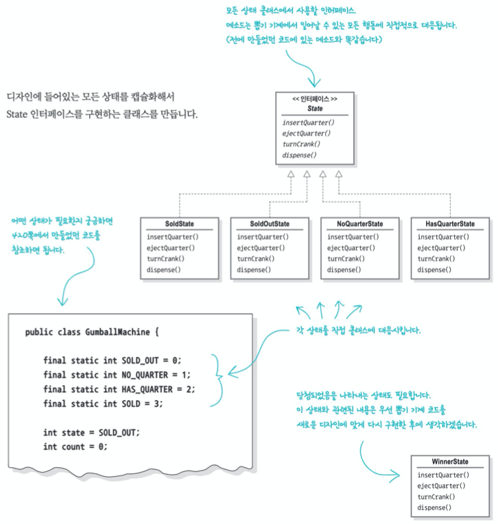
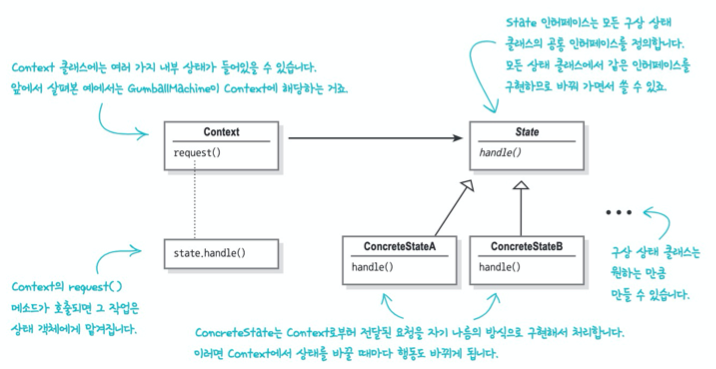

# CHAPTER 10 - 상태 패턴

> **전략 패턴과 상태 패턴은 쌍둥이이다.**
>
> 전략 패턴은 바꿔 쓸 수 있는 알고리즘을 내세워 큰 성동을 거둔 반면에, 상태 패턴은 내부 상태를 바꿈으로써 객체가 행동을 바꿀 수 있도록 도와주는 길을 택했다. 꽤나 다르지만 그 밑바탕에 깔린 설계는 거의 같다.


## 예제: 최첨단 뽑기 기계



- state: 동전 없음, 동전 있음, 알맹이 판매, 알맹이 매진
- action: 동전 투입, 동전 반환, 손잡이 돌림, 알맹이 내보냄


## 상태 기계 기초 지식 알아보기

1. 상태를 모아본다.

   - 동전 없음, 동전 있음, 알맹이 매진, 알맹이 판매

2. 현재 상태를 저장하는 인스턴스 변수를 만들고 각 생태의 값을 정의한다.

   - ```java
     final static int SOLD_OUT = 0;      // 알맹이 매진
     final static int NO_QUARTER = 1;    // 동전 없음
     final static int HAS_QUARTER = 2;   // 동전 있음
     final static int SOLD = 3;          // 알맹이 판매
     
     int state = SOLD_OUT;               // 현재 상태를 저장하는 변수
     ```

3. 시스템에서 일어날 수 있는 모든 행동을 모아본다.

   - 동전 투입, 동전 반환 -> 다이어그램을 보면 이런 행동을 실행할 때 상태가 바뀐다는 것을 알 수 있다.
   - 손잡이 돌림, 알맹이 내보냄 -> 뽑기 기계의 인터페이스이다. 알맹이를 꺼내는 행동은 사용자가 조작해서 만드는 행동이 아니라 기계 내에서 자체적으로 진행하는 행동에 가깝다.

4. 위 내용을 바탕으로 상태 기계 역할을 하는 클래스를 만든다.

   - ```java
     public void insertQuarter() {
       if (state == HAS_QUARTER) {
         System.out.println("동전은 한 개만 넣어주세요.");
       } else if (state == NO_QUARTER) {
         state = HAS_QUARTER;
         System.out.println("동전이 투입되었습니다.");
       } else if (state == SOLD_OUT) {
         System.out.println("매진되어습니다. 다음 기회에 이용해주세요.");
       } else if (state == SOLD) {
         System.out.println("알맹이를 내보내고 있습니다.");
       }
     }
     ```


## 뽑기 기계 코드 만들기

상태는 인스턴스 변수에 저장한다. 그리고 그 상태값으로 모든 행동 및 상태 전환을 처리한다.

```java
public class GumballMachine {
  final static int SOLD_OUT = 0;
  final static int NO_QUARTER = 1;
  final static int HAS_QUARTER = 2;
  final static int SOLD = 3;
  
  int state = SOLD_OUT;
  int count = 0;
  
  public GumballMachine(int count) {
    this.count = count;
    if (count > 0) {
      state = NO_QUARTER;
    }
  }
  
  // 동전 투입
  public void insertQuarter() {
    if (state == HAS_QUARTER) {
      System.out.println("동전은 한 개만 넣어 주세요.");
    } else if (state == NO_QUARTER) {
      state = HAS_QUARTER;
      System.out.println("동전을 넣으셨습니다.");
    } else if (state == SOLD_OUT) {
      System.out.println("매진되었습니다. 다음 기회에 이용해 주세요."); // 매진 상태에서는 동전을 반환한다.
    } else if (state == SOLD) {
      System.out.println("알맹이를 내보내고 있습니다.");
    }
  }
  
  // 동전 반환
  public void ejectQuarter() {
    if (state == HAS_QUARTER) {
      System.out.println("동전이 반환됩니다.");
      state = NO_QUARTER;
    } else if (state == NO_QUARTER) {
      System.out.println("동전을 넣어 주세요.");
    } else if (state == SOLD) {
      System.out.println("이미 알맹이를 뽑으셨습니다.");
    } else if (state == SOLD_OUT) {
      System.out.println("동전을 넣지 않으셨습니다. 동전이 반환되지 않습니다.");
    }
  }
  
  // 손잡이 돌림
  public void turnCrank() {
    if (state == SOLD) {
      System.out.println("손잡이는 한 번만 돌려 주세요.");
    } else if (state == NO_QUARTER) {
      System.out.println("동전을 넣어 주세요.");
    } else if (state == SOLD_OUT) {
      System.out.println("매진되었습니다.");
    } else if (state == HAS_QUARTER) {
      System.out.println("손잡이를 돌리셨습니다.");
      state = SOLD;
      dispense();
    }
  }
  
  // 알맹이 내보냄
  public void dispense() {
    if (state == SOLD) {
      System.out.println("알맹이를 내보내고 있습니다.");
      count = count - 1;
      if (count = 0) {
        System.out.println("더 이상 알맹이가 없습니다.");
        state = SOLD_OUT;
      } else {
        state = NO_QUARTER;
      }
    } else if (state == NO_QUARTER) {
      System.out.println("동전을 넣어 주세요.");
    } else if (state == SOLD_OUT) {
      System.out.println("매진입니다.");
    } else if (state == HAS_QUARTER) {
      System.out.println("알맹이를 내보낼 수 없습니다.");
    }
  }
  
  ...
}
```


## 뽑기 기계 코드 수정 요청

"10번에 1번 꼴로 손잡이를 돌릴 때 알맹이가 2개 나오도록 코드를 수정"해야 한다는 요청이 왔다.

새로운 상태(WINNER, 당첨됐다는 사실을 나타내는 상태)를 추가하려고 하니, 각 액션 메서드에 분기문을 모두 추가해야하는 변경이 필요하게 됐다. -> 확장에 어려운 구조.

관리와 수정이 편하게 코드를 리팩터링 해보자.

- 상태별로 일어나는 일을 국지화해서 하나의 상태 코드를 수정할 때 다른 코드까지 엉망이 되는 일을 막자.
- 상태별 행동을 별도의 클래스에 넣어 두고 모든 상태에서 각각 자기가 할 일을 구현하도록 하자.
- 뽑기 기계가 현재 상태를 나타내는 상태 객체에게 작업을 넘기게하자.
- 그럼, 상태를 새로 추가할 때 그냥 클래스를 새로 추가하고 상태 전환과 관련된 코드를 조금만 수정하면 이전 코드에 비해 훨씬 적은 부분만 영향을 받게 될 것이다.


## 새로운 디자인 구상하기

기존 코드를 그대로 활용하는 대신 상태 객체들을 별도의 코드에 넣고, 어떤 행동이 일어나면 현재 상태 객체에서 필요한 작업을 처리하게 하자.

1. 우선 뽑기 기계와 관련된 모든 행동에 관한 메서드가 들어있는 State 인터페이스를 정의하자.
2. 그다음에는 기계의 모든 상태를 대상으로 상태 클래스를 구현하자. 기계가 어떤 상태에 있다면, 그 상태에 해당하는 상태 클래스가 모든 작업을 책임져야 한다.
3. 마지막으로 조건문 코드를 전부 없애고  상태클래스에 모든 작업을 위임하자.


## State 인터페이스 및 클래스 정의하기

디자인에 들어있는 모든 상태를 캡슐화해서 State 인터페이스를 구현하는 클래스를 만든다.




## State 클래스 구현하기

```java
public class NoQuarterState implements State {
  GumballMachine gumballMachine;
  
  public NoQuarterState(BumballMachine gumballMachine) {
    this.gumballMachine = gumballMachine;
  }
  
  public void insertQuarter() {
    System.out.println("동전을 넣으셨습니다.");
    gumballMachine.setState(gumballMachine.getHasQuarterState());
  }
  
  public void ejectQuarter() {
    System.out.println("동전을 넣어 주세요.");
  }
  
	public void turnCrank() {
    System.out.println("동전을 넣어 주세요.");
  }
  
  public void dispense() {
    System.out.println("동전을 넣어 주세요.");
  }
}
```

(다른 State들은 생략)


## 뽑기 기계 코드 수정하기

상태와 관련된 인스턴스 변수를 정수를 사용하는 방식에서 상태 객체를 사용하는 방식으로 변경한다.

```java
public class GumballMachine {
  State soldOutState;
  State noQuarterState;
  State hasQuarterState;
  State soldState;
  
  State state;
  int count = 0;
  
  public GumballMAchine(int numberGumballs) {
    soldOutState = new SoldOutState(this);
    noQuarterState = new NoQuarterState(this);
    hasQuarterState = new HasQuarterState(this);
    soldState = new SoldState(this);
    
    this.count = numberGumballs;
    if (numberGumballs > 0) {
      state = noQuarterState;
    } else {
      state soldOutState;
    }
  }
  
  public void insertQuarter() {
    state.insertQuarter();
  }
  
  public void ejectQuarter() {
    state.ejectQuarter();
  }
  
  public void turnCrank() {
    state.turnCrank();
    state.dispense();
  }
  
  void setState(State state) {
    this.state = state;
  }
  
  void releaseBall() {
    System.out.println("알맹이를 내보내고 있습니다.");
    if (count > 0) {
      count = count - 1;
    }
  }
  
  ...
}
```


"10번에 1번 꼴로 손잡이를 돌릴 때 알맹이가 2개 나오도록 코드를 수정"하기 위해 WinnerState와 기능을 수정해보자.

```java
public class WinnerState implements State {
  ...
    
  public void dispense() {
    gumballMachine.releaseBall();
    if (gumbalMachine.getCount() == 0) {
      gumballMachine.setState(gumballMachine.getSoldOutState());
    } else {
      gumballMachine.releaseBall();
      System.out.println("축하드립니다! 알맹이를 하나 더 받으실 수 있습니다.");
      if (gumballMachine.getCount() > 0) {
        gumballMachine.setState(gumballMachine.getNoQuarterState());
      } else {
        System.out.println("더 이상 알맹이가 없습니다.");
        gumballMachine.setState(gumballMachine.getSoldOutState());
      }
    }
  }
}
```

```java
public class HasQuarterState implements State {
  Random randomWinner = new Random(System.currentTimeMillis());
  GumballMachine gumballMachine;
  
  public HasQuarterState(GumballMachine gumballMachine) {
    this.gumballMachine = gumballMachine;
  }
  
  public void insertQuarter() {
    System.out.println("동전은 한 개만 넣어 주세요.");
  }
  
  public void ejectQuarter() {
    System.out.println("동전이 반환됩니다.");
    gumballMachine.setState(gumballMachine.getNoQuarterState());
  }
  
  public void trunkCrank() {
    System.out.println("손잡이를 돌리셨습니다.");
    int winner = randomWinner.nextInt(10);
    if ((winner == 0) && (gumballMachine.getCount() > 1)) {
      gumballMachine.setState(gumballMachine.getWinnerState());
    } else {
      gumballMachine.setState(gumballMachine.getSoldState());
    }
  }

  public void dispense() {
    System.out.println("알맹이를 내보낼 수 없습니다.");
  }
}
```


## 뽑기 기계 구조 다시 살펴보기

GumballMachine 클래스의 구조는 처음 구조와는 꽤 거리가 있다. 하지만 기능 면에서 보면 완전히 같다. 구현을 구조적으로 바꿈으로서 다음과 같은 결과를 얻을 수 있었다.

- 각 상태의 행동을 별개의 클래스로 국지화했다.
- 관리하기 힘든 if 선언문들을 없앴다.
- 각 상태를 변경에는 닫혀 있게 했고, GumballMachine 클래스는 새로운 상태 클래스를 추가하는 확장에는 열려 있도록 고쳤다. (OCP)
- 최초 다이어그램에 훨씬 가까우면서 더 이해하기 좋은 코드 베이스와 클래스 구조를 만들었다.


## 상태 패턴의 정의

> **상태 패턴**(State Pattern)을 사용하면 객체의 내부 상태가 바뀜에 따라서 객체의 행동을 바꿀 수 있다. 마치 객체의 클래스가 바뀌는 것과 같은 결과를 얻을 수 있다.




전략 패턴도 위와 같은 똑같은 다이어그램으로 정의된다. 하지만 **상태 패턴과 전략 패턴의 용도는 다르다.**

상태 패턴을 사용할 때는 상태 객체에 일련의 행동이 캡슐화된다. 상황에 따라 Context 객체에서 여러 상태 객체 중 한 객체에게 모든 행동을 맡기게 된다. 그 객체의 내부 상태에 따라 현재 상태를 나타내는 객체가 바뀌게 되고, 그 결과로 Context 객체의 행동도 자연스럽게 바뀌게 된다. 클라이언트는 상태 객체를 몰라도 된다.

하지만 전략 패턴을 사용할 때는 일반적으로 클라이언트가 Context 객체에게 어떤 전략 객체를 사용할지 지정해준다. 일반적으로 전략 패턴은 서브클래스를 만드는 방법을 대신해서 유연성을 극대화하는 용도로 쓰인다.

