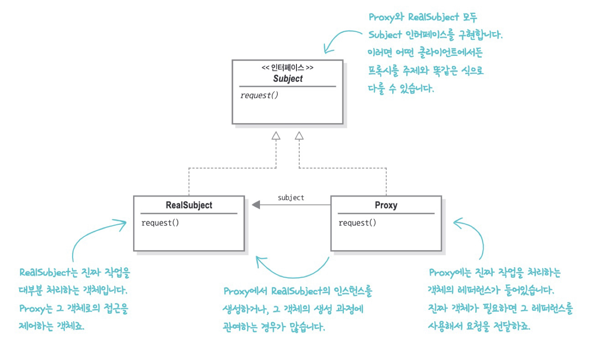
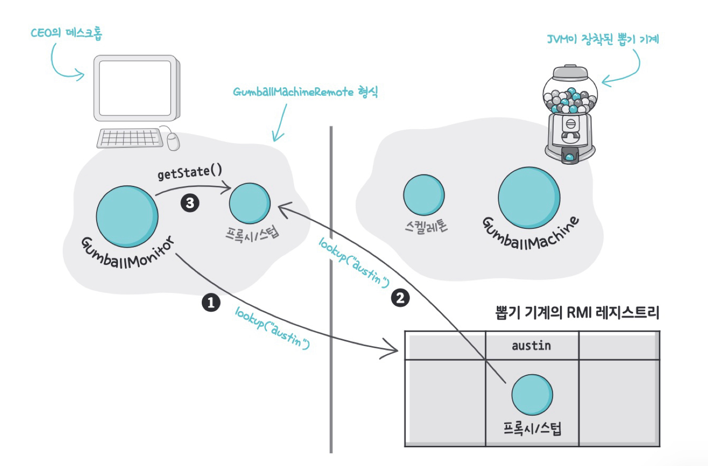
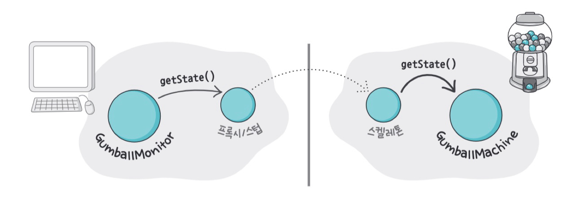
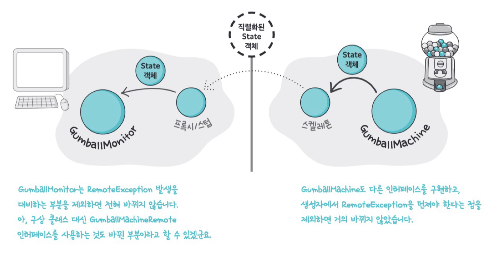
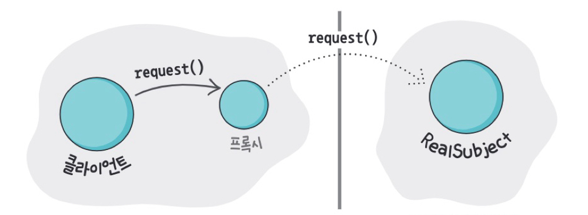
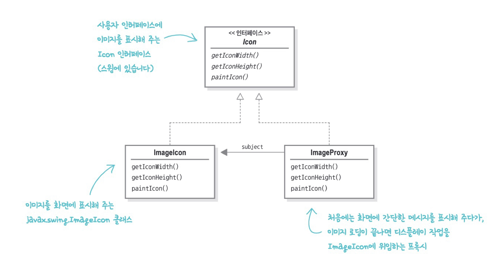
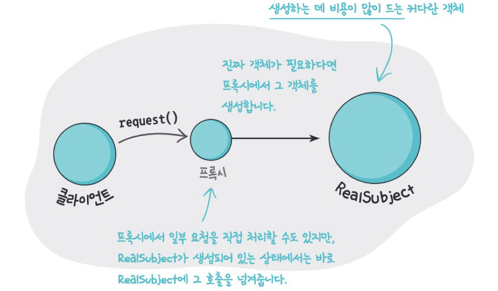
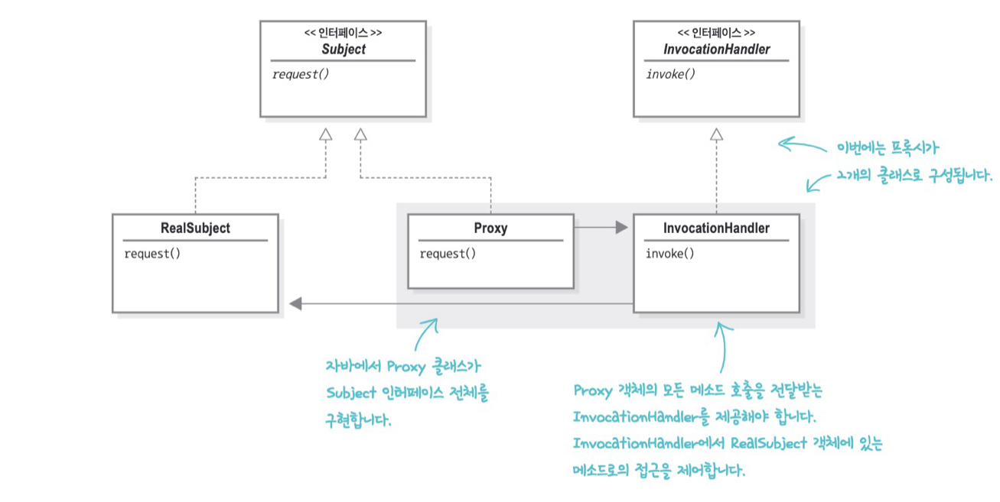
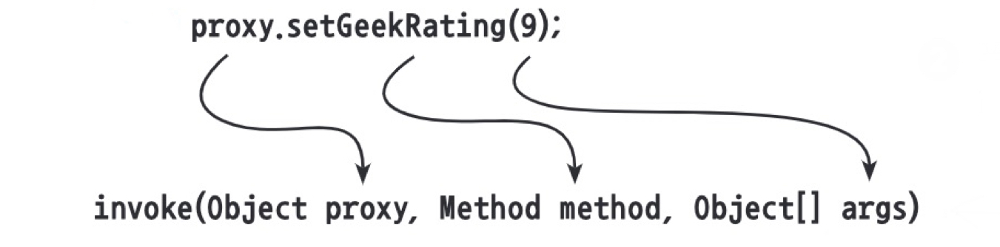
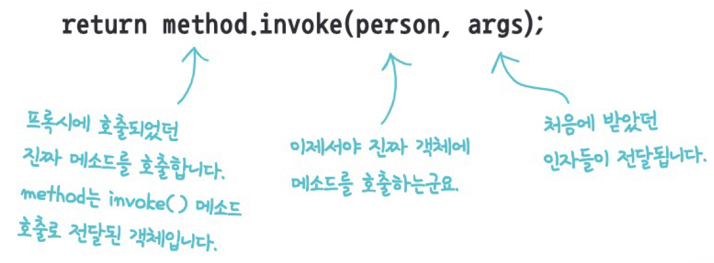

# 11. 프록시 패턴


***집주인을 대신해 손님을 맞이하는 대리인(프록시)***

특정 객체로의 접근을 제어하는 대리인(특정 객체를 대변하는 객체)를 제공하는 패턴이다.


## 실습 코드

### 1. 게임 머신 신규 요구사항 (_01_before)

이전 상태 패턴에서 다뤘던 뽑기 기계의 상태를 좀 더 확실히 파악하고 싶다는 비지니스 요구사항이 생겼다. 모든 뽑기 기계의 재고와 현재 상태를 알려달라는 요구사항이다.

각 뽑기 기계의 위치를 알려주는 `location` 필드와 CEO용 보고서를 출력하는 메소드를 만들면 된다.

***GumballMachine.java***

```java
public class GumballMachine {
    // ...
    
    String location;

    public GumballMachine(String location, int count) {
        this.location = location;
    }

    public String getLocation() {
        return location;
    }

    // ...
}
```


이제 뽑기 기계의 위치, 재고 , 현재 상태를 가져와 깔끔한 보고서를 출력해보자.

***GumballMonitor.java***

```java
public class GumballMonitor {
    GumballMachine machine;

    public GumballMonitor(GumballMachine machine) {
        this.machine = machine;
    }

    public void report() {
        System.out.println("뽑기 기계 위치: " + machine.getLocation());
        System.out.println("현재 재고: " + machine.getCount());
        System.out.println("현재 상태: " + machine.getState());
    }
}
```


다음과 같이 모니터링이 필요한 뽑기 기계를 `GumballMonitor`에 넘겨주면 된다. 보고서가 필요할 땐 `report()`만 호출하면 된다.

***TestDrive.java***

```java
int count = 0;

if (args.length < 2) {
  System.out.println("GumballMachine <name> <inventory>");
  System.exit(1);
}

count = Integer.parseInt(args[1]);
GumballMachine gumballMachine = new GumballMachine(args[0], count);
GumballMonitor monitor = new GumballMonitor(gumballMachine);
monitor.report();
```


개발이 끝나자마자 새로운 요구사항이 들어왔다. 뽑기 기계를 원격으로 모니터링 하고 싶다는 것이다. 현재는 모니터 코드가 뽑기 기계랑 같은 JVM에서 돌아가고 있다. `GumballMonitor` 는 그대로 두고 대신 원격 객체의 프록시만 넘기도록 해보자.

> 
>
> ***프록시 패턴***
>
> 특정 객체로의 접근을 제어하는 대리인(특정 객체를 대변하는 객체)를 제공하는 패턴이다. 여기서 프록시는 다른 객체의 **대리인**이다. 대리인은 여러 종류가 있으며 대개 **접근을 제어하는 방법을 다르게 제공**한다. 원격 객체라던가 생성하기 힘든 객체, 보안이 중요한 객체와 같은 다른 객체로의 접근을 제어한다.


### 2. 원격 프록시 (_02_remote_proxy)




CEO가 모니터링을 시작하면 `GumballMonitor`는 우선 뽑기 기계의 원격 객체의 프록시를 가져온다. 그 후 `getState()`, `getCount()`, `getLocation()`을 호출한다.




프록시의 `getState()`가 호출되면 프록시는 그 호출을 원격 서비스로 전달한다. 스켈레톤은 그 요청을 받아 뽑기 기계에 전달한다.




`GumballMachine`은 스켈레톤에게 상태를 리턴한다. 그럼 스켈레톤은 리턴값을 직렬화한 다음 네트워크로 프록시에게 전달한다. 프록시는 리턴값을 역직렬화해서 `GumballMonitor`에게 리턴한다.


> 
>
> ***원격 프록시***
>
> 다른 JVM에 들어있는 객체의 대리인에 해당하는 로컬 객체이다. 프록시의 메소드를 호출하면 그 호출이 네트워크로 전달되어 결국 원격 객체의 메소드가 호출된다. 


### 3. 가상 프록시 (_03_virutal_proxy)

앨범 커버 뷰어를 만들어야 하는 요구사항이 생겼다. 네트워크로부터 이미지를 불러들여 커버 이미지를 생성하고자하는데, 네트워크의 상태와 인터넷 연결 속도에 따라 시간이 걸릴 수 있다. 이 동안 화면에 뭔가 다른걸 보여주고 싶고, 이미지 가져오는 동안 어플리케이션이 멈추지 않게하고 싶다. 

가상 프록시를 사용하면 이 2가지 조건을 간단하게 만족할 수 있다. 가상 프록시가 아이콘 대신 백그라운드에서 이미지를 불러오는 작업을 처리하고, 이미지를 완전히 가져오기 전까지는 "앨범 커버를 불러오는 중입니다. 잠시만 기다려주세요."와 같은 메시지를 보여주면 된다.




위에서 다룬 원격 프록시 클래스 다이어그램과 똑같이 생겼지만, 여기에서는 프록시가 네트워크로 연결되어 있는 다른 객체를 대변하는 용도가 아니라 생성하는 데 많은 비용이 드는 객체(아이콘 데이터를 네트워크로 가져오기)를 숨기는 용도로 쓰인다.


프록시의 구현은 다음과 같다.

***ImageProxy.java***

```java
class ImageProxy implements Icon {
	volatile ImageIcon imageIcon;
	final URL imageURL;
	Thread retrievalThread;
	boolean retrieving = false;
     
	public ImageProxy(URL url) { imageURL = url; }
     
	public int getIconWidth() {
		if (imageIcon != null) {
            return imageIcon.getIconWidth();
        } else {
			return 800;
		}
	}
 
	public int getIconHeight() {
		if (imageIcon != null) {
            return imageIcon.getIconHeight();
        } else {
			return 600;
		}
	}
	
	synchronized void setImageIcon(ImageIcon imageIcon) {
		this.imageIcon = imageIcon;
	}
     
	public void paintIcon(final Component c, Graphics  g, int x,  int y) {
		if (imageIcon != null) {
			imageIcon.paintIcon(c, g, x, y);
		} else {
			g.drawString("Loading album cover, please wait...", x+300, y+190);
			if (!retrieving) {
				retrieving = true;
				
				retrievalThread = new Thread(new Runnable() {
					public void run() {
						try {
							setImageIcon(new ImageIcon(imageURL, "Album Cover"));
							c.repaint();
						} catch (Exception e) {
							e.printStackTrace();
						}
					}
				});
				
				retrievalThread = new Thread(() -> {
						try {
							setImageIcon(new ImageIcon(imageURL, "Album Cover"));
							c.repaint();
						} catch (Exception e) {
							e.printStackTrace();
						}
				});
				retrievalThread.start();
				
			}
		}
	}
}
```

> 33: 이미지를 가져오는 동안은 잠시 기다려달라는 문구를 보여준다.
>
> 37: 이미지를 불러오는 작업 동안 화면이 멈추면 안되므로 별도의 스레드를 통해 작업한다.
>
> 40: 로드가 완료되면 `RealObject`인 `ImageIcon`을 만들고 화면에 이미지를 그리도록 한다.


가상 프록시의 정의는 다음과 같다.

> 
>
> **가상 프록시**
>
> 생성하는데 많은 비용이 드는 객체를 대신한다. 진짜 객체가 필요한 상황이 오기 전까지 객체의 생성을 미루는 기능을 제공한다. 객체 생성 전이나 객체 생성 도중에 객체를 대신하기도 한다. 객체 생성이 끝나면 그냥 `RealSubject`에 직접 요청을 전달한다.


### 4. 보호 프록시 (_04_protection_proxy)

자바의 `java.lang.refelct` 패키지에는 프록시 기능이 내장되어있다. 이 패키지를 사용하면 즉석에서 하나 이상의 인터페이스를 구현하고, 지정한 클래스에 메소드 호출을 전달하는 프록시 클래스를 만들 수 있다. 진짜 프록시 클래스는 실행 중에 생성되므로 이러한 자바 기술을 **동적 프록시(dynamic proxy)**라고 부른다.

> 🗣 종민 : Spring AOP - JDK dynamic proxy VS cglib
>
> - JDK dynamic proxy는 인터페이스가 필요하다.
>
> - CGLIB이 인터페이스가 아닌 경우에 대한 프록시를 만들어준다. 바이트코드 조작으로 생성해주고, 상속을 사용하기 때문에 대상 클래스가 final이면 안된다.


> 
>
> ***보호 프록시***
>
> 자신과 같은 인터페이스를 구현하는 실객체의 특정 메소드로의 접근을 제어한다. 


보호 프록시를 이용해 본인은 자신의 매력 지수를 수정할 수 없고 개인 정보만 수정할 수 있도록, 그리고 다른 사람의 매력 지수를 조작할 수 있고 개인 정보는 수정할 수 없는 데이팅 앱을 만들 수 있다. 

#### 1. 동적 프록시 만들기

#### `InvocationHandler` 생성

먼저 `InvocationHandler(호출 핸들러)`를 만든다. 

프록시의 메소드가 호출되면 프록시는 그 호출을 호출 핸들러에게 넘긴다. 하지만 호출 핸들러에 있는 같은 이름의 메소드를 호출하는 것은 아니다. `InvocationHandler`에는 `invoke()`라는 하나의 메소드만 존재한다. 프록시의 어떤 메소드가 호출되든 무조건 핸들러에 있는 `invoke()` 메소드를 호출한다.

***프록시의 `setGeekRating()`가 호출된 경우***




***핸들러에서 어떻게 처리할지 결정 후 `RealSubject`로 요청 전달***




이제 실제 핸들러를 만들어보자.

***OwnerInvocationHandler.java (본인용 핸들러)***

```java
public class OwnerInvocationHandler implements InvocationHandler { 
	Person person;
 
	public OwnerInvocationHandler(Person person) {
		this.person = person;
	}
 
	public Object invoke(Object proxy, Method method, Object[] args) 
			throws IllegalAccessException {
  
		try {
			if (method.getName().startsWith("get")) {
				return method.invoke(person, args);
   			} else if (method.getName().equals("setGeekRating")) {
				throw new IllegalAccessException();
			} else if (method.getName().startsWith("set")) {
				return method.invoke(person, args);
			} 
        } catch (InvocationTargetException e) {
            e.printStackTrace();
        } 
		return null;
	}
}
```

> 12: 본인은 개인 정보를 가져올 수 있다.
>
> 14: 본인이 지수를 수정하려하면 예외를 던진다.
>
> 16: 본인은 개인 정보를 설정할 수 있다.


#### 2. 동적 프록시 생성

동적 프록시는 다음과 같이 만들 수 있다. 

***getOwnerProxy.java***

```java
Person getOwnerProxy(Person person) {	
  return (Person) Proxy.newProxyInstance( 
    person.getClass().getClassLoader(),
    person.getClass().getInterfaces(),
    new OwnerInvocationHandler(person));
}
```


## 다른 프록시

- **캐싱 프록시 (Caching Proxy)**

  비용이 많이 드는 작업의 결과를 임시로 저장해준다. 여러 클라이언트에서 결과를 공유하게 해줌으로서 계산 시간과 네트워크 지연을 줄여준다.

  

- **스마트 레퍼런스 프록시 (Smart Reference Proxy)**

  주제가 참조될 때마다 추가 행동을 제공한다. 객체의 레퍼런스 개수를 센다든가하는 식으로 말이다.

  

- **동기화 프록시 (Synchronization Proxy)**

  여러 스레드에서 주제에 접근할 때 안전하게 작업을 처리할 수 있게 해준다.


- **지연 복사 프록시 (Copy-On-Write Proxy)**

  클라이언트에서 필요로 할 때까지 객체가 복사되는 것을 지연시킴으로써 객체의 복사를 제어한다. 변형된 가상 프록시라고 할 수 있다.


- **복잡도 숨김 프록시 (Complexity Hiding Proxy)**

  복잡한 클래스의 집합으로의 접근을 제어하고 그 복잡도를 숨겨준다. 퍼사드와 비슷하지만 프록시는 접근을 제어하지만, 퍼사드 패턴은 대체 인터페이스만 제공한다는 점이다.

  

- **방화벽 프록시 (Firewall Proxy)**

  일련의 네트워크 자원으로의 접근을 제어함으로써 주제를 '나쁜' 클라이언트로부터 보호해준다.