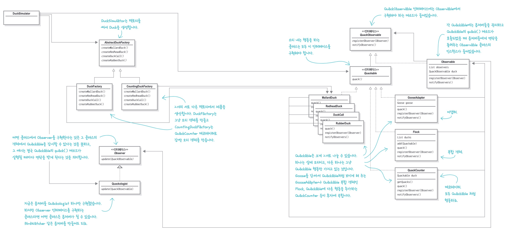
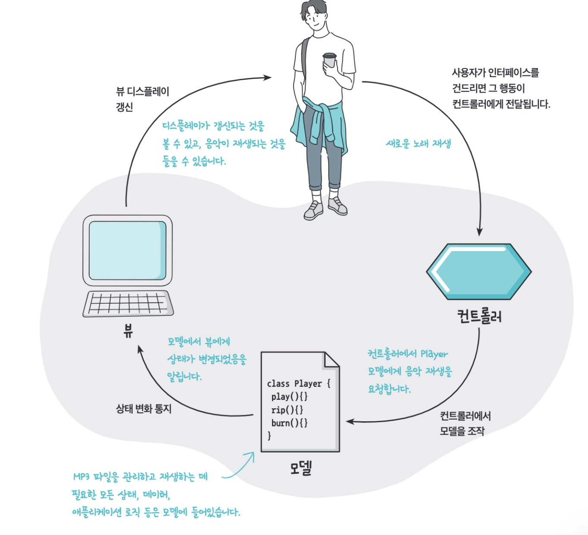
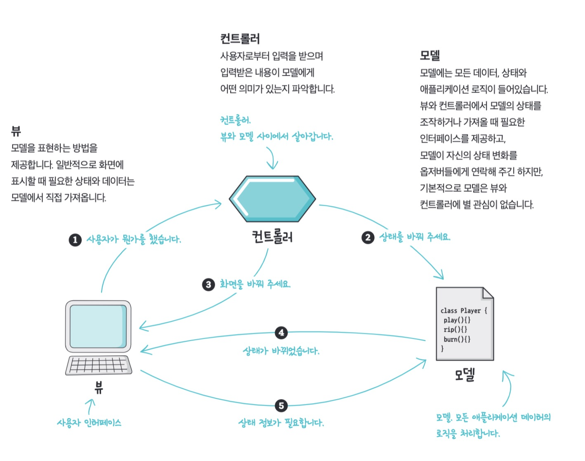
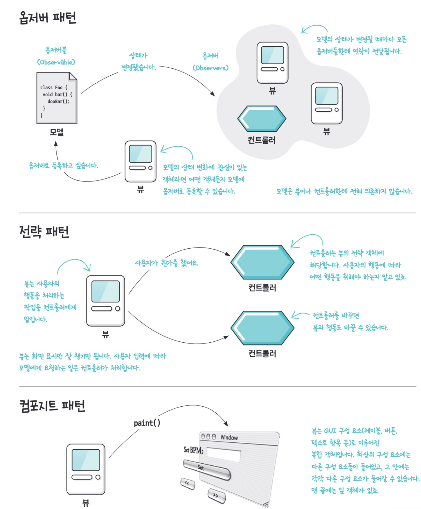
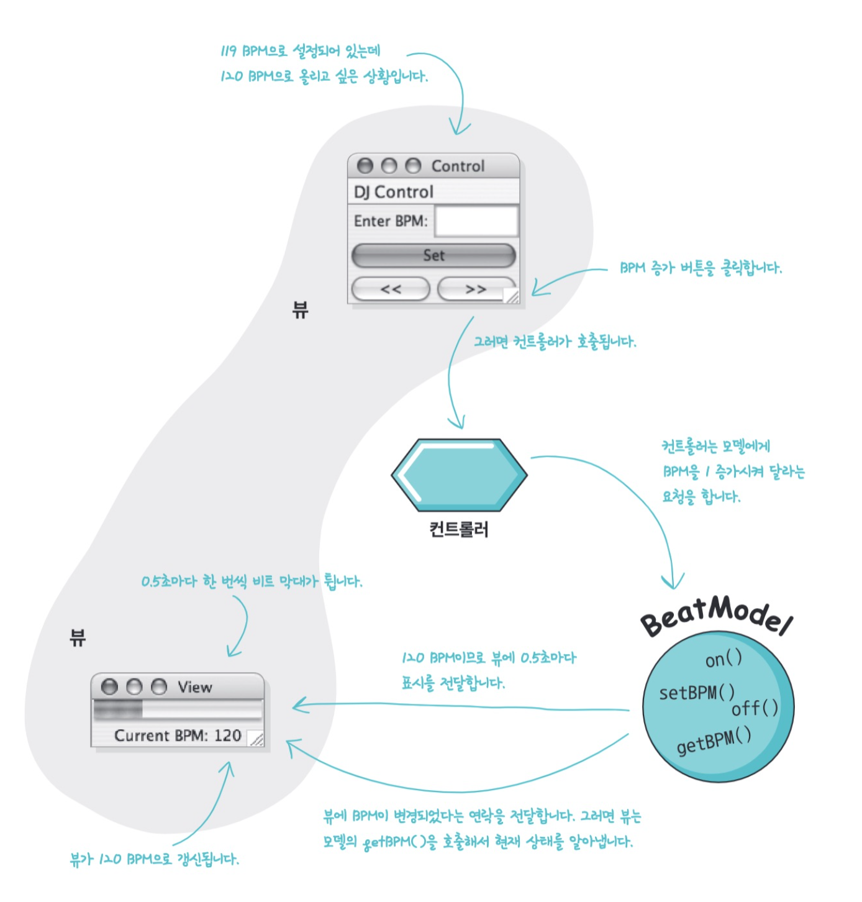
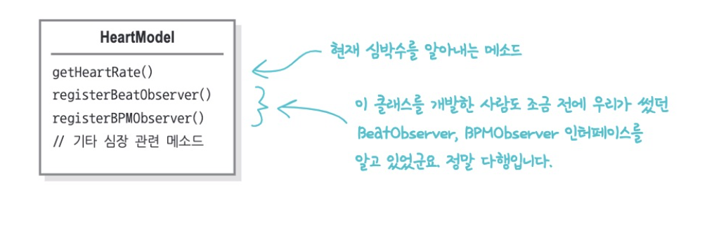

# 12. 복합 패턴

## 패턴 섞어 쓰기

여러 패턴을 함께 사용해서 디자인 문제 해결 (패턴으로 이루어진 패턴)

패턴 몇개를 결합한다고 해서 무조건 복합 패턴이 되는 것은 아니고 여러가지 문제의 일반적인 해결법을 제시해야 한다.

> 복합 패턴 - 2개 이상의 패턴을 결합해서 일반적으로 자주 등장하는 문제들의 해법을 제공

### 1. 오리 시뮬레이션 게임에 다양한 패턴 적용하기

```java
public class DuckSimulator {
 public static void main(String[] args) {
  DuckSimulator simulator = new DuckSimulator();
  simulator.simulate();
 }

 void simulate() {
  Quackable mallardDuck = new MallardDuck();
  Quackable redheadDuck = new RedheadDuck();
  Quackable duckCall = new DuckCall();
  Quackable rubberDuck = new RubberDuck();

  System.out.println("\n오리 시뮬레이션 게임");

  simulate(mallardDuck);
  simulate(redheadDuck);
  simulate(duckCall);
  simulate(rubberDuck);
 }

  // 다형성을 이용하여 소리 내기
	void simulate(Quackable duck) {
  	duck.quack();
	}
}
```


1) 다형성을 이용하여 여러 오리 만들기

2) 어댑터 패턴 적용하기

   - 거위 추가하기

   - 거위는 quack()이 아닌 honk() 메서드 사용

   ```java
   public class Goose {
     public void honk() {
       System.out.println("끽끽");
     }
   }
   ```

   ```java
   public class GooseAdapter implements Quackable {
   	Goose goose;
   
   	public GooseAdapter(Goose goose) {
   		this.goose = goose;
   	}
   
   	@Override
   	public void quack() {
   		goose.honk();
   	}
   }
   ```

3) 데코레이터 패턴 적용하기

   - 꽥꽥 소리 횟수 추가하기	

     ```java
     public class QuackCounter implements Quackable {
     	Quackable duck;
     	static int numberOfQuacks;
     
     	public QuackCounter (Quackable duck) {
     		this.duck = duck;
     	}
     
     	public void quack() {
     		duck.quack();
     		numberOfQuacks++;
     	}
     
     	public static int getQuacks() {
     		return numberOfQuacks;
     	}
     }
     ```

     ```java
     public class DuckSimulator {
     	public static void main(String[] args) {
     		DuckSimulator simulator = new DuckSimulator();
     		simulator.simulate();
     	}
     
     	void simulate() {
     		Quackable mallardDuck = new QuackCounter(new MallardDuck());
     		Quackable redheadDuck = new QuackCounter(new RedheadDuck());
     		Quackable duckCall = new QuackCounter(new DuckCall());
     		Quackable rubberDuck = new QuackCounter(new RubberDuck());
     		Quackable gooseDuck = new GooseAdapter(new Goose());
     
     		System.out.println("\n오리 시뮬레이션 게임 (+거위 어댑터)");
     
     		simulate(mallardDuck);
     		simulate(redheadDuck);
     		simulate(duckCall);
     		simulate(rubberDuck);
     		simulate(gooseDuck);
     	}
     
     	void simulate(Quackable duck) {
     		duck.quack();
     	}
     }
     ```

4) 팩토리 패턴 적용하기

   - 꽥꽥 소리를 제대로 세기

   - 데코레이터를 쓸 때는 객체를 제대로 포장해야 함

   - 오리를 생성하고 데코레이터로 감싸는 부분을 따로 빼내서 캡슐화하자

     ```java
     public abstract class AbstractDuckFactory {
     
      public abstract Quackable createMallardDuck();
      public abstract Quackable createRedheadDuck();
      public abstract Quackable createDuckCall();
      public abstract Quackable createRubberDuck();
     }
     ```

5) 컴포지트 패턴 적용하기

   - 오리 무리를 관리하는 기능 적용하기 (오리를 1마리씩 관리하지 않고 오리들로 구성된 컬렉션 등으로 관리하기)

     ```java
     public class Flock implements Quackable {
      ArrayList<Quackable> quackers = new ArrayList<Quackable>();
     
      public void add(Quackable quacker) {
       quackers.add(quacker);
      }
     
      public void quack() {
       Iterator<Quackable> iterator = quackers.iterator(); // 반복자 패턴
       while (iterator.hasNext()) {
        Quackable quacker = iterator.next();
        quacker.quack();
       }
      }
     }
     ```

> **안정성 vs 투명성**
> 컴포지트 패턴에서는 복합 객체와 잎 객체에는 add() 메소드가 똑같이 들어있었습니다.. 잎 객체에는 add 메서드가 필요하지 않은데도 넣어야 했습니다. 여기서는 복합 객체에서 자식을 관리하는 메서드를 복합 객체에만 넣었습니다. Add() 메소드는 Flock 에만 있고 오리에는 add()메소드가 없습니다. 
> 이런 디자인은 구성 요소에서 어떤 의미도 갖지 못하는 메소드는 아예 호출할 수 없으므로 더 안전하지만 투명성은 떨어집니다. (그 객체가 Flock인지아닌지를 확실하게 알아야하니까)
> 따라서 장단점을 잘 따져봐서 적용해야합니다.

6. 옵저버 패턴 적용하기

   - 오리들을 1마리씩 실시간으로 추적하지

   - 관찰 대상이 되는 Observable 추가하기

   ```java
   public interface QuackObservable {
    public void registerObserver(Observer observer); // 등록
    public void notifyObservers(); // 연락돌리기
   }
   ```

   ```java
   public interface Quackable extends QuackObservable {
    public void quack();
   }
   ```

   - 2장에서 했던 방식은 모든 클래스에서 일일이 등록하고, 연락용 메소드를 구현했다.
     이번에는 등록 및 연락용 코드를 Observable 클래스에 캡슐화하고 구성으로 QuackObservable에 포함시켜서 QuackObservable이 필요한 작업을 Observable 보조 클래스에 전부 위임하게 만들어보자

   ```java
   public class Observable implements QuackObservable {
   	List<Observer> observers = new ArrayList<Observer>();
   	QuackObservable duck;
   
   	public Observable(QuackObservable duck) {
   		this.duck = duck;
   	}
   
   	public void registerObserver(Observer observer) {
   		observers.add(observer);
   	}
   
   	public void notifyObservers() {
   		Iterator<Observer> iterator = observers.iterator();
   		while (iterator.hasNext()) {
   			Observer observer = iterator.next();
   			observer.update(duck);
   		}
   	}
   
   	public Iterator<Observer> getObservers() {
   		return observers.iterator();
   	}
   }
   ```

   ```java
   public class Quackologist implements Observer { // 옵접 ㅓ역할
   
   	public void update(QuackObservable duck) {
   		System.out.println("꽥꽥학자: " + duck + " 가 방금 소리냈다.");
   	}
   }
   ```


여기 사용된 패턴이 복합 패턴은 아니다. 여러 패턴을 섞어썼을 뿐.

복합 패턴은 몇개의 패턴을 복합적으로 사용해서 일반적인 문제를 해결할 수 있어야 한다. (MVC)


### 2. 바뀐 내용 돌아보기

1. 수많은 Quackable
2. 거위도 Quackable에 추가하기 위해 어댑터 패턴 적용
3. 꽥꽥 소리가 난 횟수를 세기 위해 데코레이터 패턴 적용 (quack 메소드 호출 자체는 quackable 객체가 처리)
4. QuackCounter로 장식되지 않은 Quackable 객체가 있을 수 있어서 추상 팩토리 패턴 적용
5. 모든 오리와 거위, Quackable 객체 관리가 어려워서 컴포지트 패턴 적용 (반복자 패턴도 사용)
6. Quackable에서 소리냈을 때 바로 연락 받고싶어서 옵저버 패턴 적용




## MVC 패턴





- 컨트롤러
  - 사용자로부터 입력을 받으며 입력받은 내용이 모델에게 어떤 의미가 있는지 파악한다
- 모델
  - 데이터, 상태, 애플리케이션 로직이 들어있다.
  - 뷰, 컨트롤러에서 모델의 상태를 조작하거나 가져올 때 필요한 인터페이스를 제공하고, 모델이 자신의 상태 변화를 옵저버들에게 연락해주긴 하지만, 기본적으로 모델은 뷰와 컨트롤러에 관심이 없음
- 뷰
  - 모델을 표현하는 방법 제공. 화면에 표시하는 상태와 데이터는 모델에서 가져온다.


1. 사용자는 뷰에만 접촉할 수 있다.
2. 컨트롤러가 모델에게 상태를 변경하라고 요청한다
3. 컨트롤러가 뷰를 변경해달라고 요청할 수도 있다.
4. 상태가 변경되면 모델이 뷰에게 그 사실을 알린다.
5. 뷰가 모델에게 상태를 요청한다.


> Q&A

Q1. 컨트롤러가 모델의 옵저버가 되는 경우는 없나요?

A1. 옵저버가 되는 경우도 있다. 디자인에 따라 컨트롤러도 모델에 옵저버로 등록하고, 상태가 변경될 때 모델로부터 연락을 받을 수 있다. 모델에 있는 뭔가에 의해 사용자 인터페이스 컨트롤이 변경될 때 해당한다. (모델 상태에 따라 인터페이스 항목이 활성화 or 비활성화)

Q2. 컨트롤러는 뷰로부터 사용자 입력을 받아오고 모델에게 보내는 역할만 하는데 왜 굳이 컨트롤러를 쓰나? 뷰에 해당 코드를 넣어도 되지 않나?

A2. 컨트롤러가 그냥 모델에게 전달하는 일만 하진 않는다. 컨트롤러는 사용자 입력 내용을 해석해서 모델을 조작하는 임무를 맡는다. 뷰 코드가 복잡해질 수 있고 뷰를 다른모델과 연결해서 재사용하기 어려워진다. 뷰-컨트롤러를 느슨하게 결합하면 더 유연하고 확장하기 좋은 디자인을 만들 수 있다.


### MVC에 사용되는 패턴 알아보기

- 모델은 옵저버 패턴을 써서 상태가 바뀔 때마다 뷰와 컨트롤러에게 연락한다.
  - 모델은 옵저버 패턴을 써서 상태가 변경되었을 때 그 모델과 연관된 객체에게 연락함.
  - 한 모델에서 서로 다른 뷰 사용 가능, 여러뷰 동시에 사용도 가능
- 뷰, 컨트롤러는 전략패턴을 사용한다. (컨트롤러는 뷰의 행동에 해당하며 다른 행동이 필요하면 다른 컨트롤러로 바꾸면 된다.)
  - 컨트롤러가 전략을 제공하고, 뷰는 애플리케이션 겉모습에만 신경쓰고 인터페이스의 행동을 결정하는 일은 컨트롤러에게 맡긴다. 
  - 전략패턴을 사용하면 뷰를 모델로부터 문리하는데에 도움됨
    - 사용자가 요청한 내역을 처리하려고 모델과 얘기하는 일을 컨트롤러가 맡아서
- 뷰 안에서는 내부적으로 컴포지트 패턴을 써서 다양한 구성요소를 관리한다.
  - 디스플레이는 윈도우, 텍스트 레이블 등으로 구성된다. 컨트롤러가 뷰에게 화면을 갱신해달라고 요청하면 최상위 뷰 구성요소에게만 갱신하라고 알려주면 나머지는 컴포지트 패턴이 알아서 처리




### BPM 제어 도구 만들기

- 뷰
  - 드럼 비트를 만들고 BPM을 조절
- 컨트롤러
  - 사용자가 DJ Control 메뉴에서 Start를 선택하면 그 입력을 모델이 해야하는 적절한 행동으로 바꾸는 작업 처리
- 모델
  - 비트를 조절하고 스피커로 소리를 내보내는 작업 처리



### 모델, 뷰, 컨트롤러 만들기

#### 1) 모델

```java
public interface BeatModelInterface {
 void initialize();

 void on();

 void off();

 void setBPM(int bpm);

 int getBPM();

 void registerObserver(BeatObserver o);

 void removeObserver(BeatObserver o);

 void registerObserver(BPMObserver o);

 void removeObserver(BPMObserver o);
}
```

```java
public class BeatModel implements BeatModelInterface, Runnable {
  // 옵저버 사용
   List<BeatObserver> beatObservers = new ArrayList<BeatObserver>();
   List<BPMObserver> bpmObservers = new ArrayList<BPMObserver>();
   int bpm = 90;
   Thread thread;
   boolean stop = false;
   Clip clip;

 public void initialize() {
  try {
   File resource = new File("clap.wav");
   clip = (Clip) AudioSystem.getLine(new Line.Info(Clip.class));
   clip.open(AudioSystem.getAudioInputStream(resource));
  }
  catch(Exception ex) {  }
 }

 public void on() { // BPM을 기본값으로 설정하고 비트를 재생하는 스레드 시작
  bpm = 90;
  notifyBPMObservers();
  thread = new Thread(this);
  stop = false;
  thread.start();
 }

 public void off() { // BPM을 0으로 설정하고, 비트를 재생하는 스레드를 멈춰서 음악 끔
  stopBeat();
  stop = true;
 }

 public void run() { // 비트 스레드를 실행해서 BPM값에 맞춰 음악을 시작한다음 옵저버에게 비트가 시작됐다고 알려준다. 사용자가 Stop을 선택하면 루프가 끝난다.
  while (!stop) {
   playBeat();
   notifyBeatObservers();
   try {
    Thread.sleep(60000/getBPM());
   } catch (Exception e) {}
  }
 }

 public void setBPM(int bpm) { // BPM 변수값 설정하고 옵저버들에게 바뀌었다고 알림
  this.bpm = bpm;
  notifyBPMObservers();
 }

 public int getBPM() {
  return bpm;
 }
	// 옵저버 등록 및 알림용 코드
  // 비트를 처리하는 오디오 코드
}
```

#### 2) 뷰

- BPM과 비트마다 통통 튀는 모습을 보여주는 막대 (뷰가 들어가있는 인터페이스)
- 제어용 인터페이스 (사용자 제어용 인터페이스)

```java
public class DJView implements ActionListener, BeatObserver, BPMObserver {

  BeatModelInterface model; // 모델
  ControllerInterface controller; // 컨트롤러 (제어용 인터페이스 코드에서만 사용됨)
  /** 화면 표시용 구성 요소 **/
  JFrame viewFrame;
  JPanel viewPanel;
  BeatBar beatBar;
  JLabel bpmOutputLabel;

  public DJView(ControllerInterface controller, BeatModelInterface model) {
    this.controller = controller;
    this.model = model;
    /** Observer 모델에 등록 **/
    model.registerObserver((BeatObserver) this);
    model.registerObserver((BPMObserver) this);
  }

  public void createView() {
		// 스윙 구성 요소 생성
  }

  // 모델 상태가 변경될 때 호출되는 메소드 (현재 BPM을 보여주는 부분 갱신)
  public void updateBPM() {
    int bpm = model.getBPM();
  
    if (bpm == 0) {
      bpmOutputLabel.setText("offline");
    } else {
      bpmOutputLabel.setText("Current BPM: " + model.getBPM());
    }
  }

  // 모델에서 새로운 비트가 연주될 때마다 호출되는 메소드 (비트 막대가 한번 튕김)
  public void updateBeat() {
    beatBar.setValue(100);
  }
}
```


- 사용자 제어용 인터페이스 부분

  ```java
  public class DJView implements ActionListener, BeatObserver, BPMObserver {
  
    BeatModelInterface model;
    ControllerInterface controller;
    JLabel bpmLabel;
    JTextField bpmTextField;
    JButton setBPMButton;
    JButton increaseBPMButton;
    JButton decreaseBPMButton;
    JMenuBar menuBar;
    JMenu menu;
    JMenuItem startMenuItem;
    JMenuItem stopMenuItem;
  
  
    public void createControls() {
      // 스윙 구성 요소 생성
    }
  
    /** 메뉴에 있는 start 및 stop 활성화 or 비활성화하는 메소드 **/
    public void enableStopMenuItem() {
      stopMenuItem.setEnabled(true);
    }
  
    public void disableStopMenuItem() {
      stopMenuItem.setEnabled(false);
    }
  
    public void enableStartMenuItem() {
      startMenuItem.setEnabled(true);
    }
  
    public void disableStartMenuItem() {
      startMenuItem.setEnabled(false);
    }
  
    /** 사용자가 버튼을 클릭했을 때 호출되는 메소드 **/
    public void actionPerformed(ActionEvent event) {
      if (event.getSource() == setBPMButton) { // set 버튼을 클릭하면 새로운 BPM이 컨트롤러에게 전달됨
        int bpm = Integer.parseInt(bpmTextField.getText());
        controller.setBPM(bpm);
      } else if (event.getSource() == increaseBPMButton) { // >> 버튼
        controller.increaseBPM();
      } else if (event.getSource() == decreaseBPMButton) { // << 버튼
        controller.decreaseBPM();
      }
    }
  }
  ```


#### 3) 컨트롤러

- 전략 객체의 인터페이스 만들기

```java
public interface ControllerInterface {
 void start();
 void stop();
 void increaseBPM();
 void decreaseBPM();
   void setBPM(int bpm);
}
```


- 컨트롤러 코드

```java
public class BeatController implements ControllerInterface {
   BeatModelInterface model;
   DJView view;

   public BeatController(BeatModelInterface model) {
      this.model = model;
      view = new DJView(this, model); // 생성자에서 View 생성하기
      view.createView();
      view.createControls();
      view.disableStopMenuItem();
      view.enableStartMenuItem();
      model.initialize();
   }

   public void start() {
      model.on();
      view.disableStartMenuItem();
      view.enableStopMenuItem();
   }

   public void stop() {
      model.off();
      view.disableStopMenuItem();
      view.enableStartMenuItem();
   }

   public void increaseBPM() {
			int bpm = model.getBPM();
			model.setBPM(bpm + 1);
   }

   public void decreaseBPM() {
     int bpm = model.getBPM();
     model.setBPM(bpm - 1);
   }

	 public void setBPM(int bpm) {
     model.setBPM(bpm);
   }
}
```

#### 4) 코드 합치기

```java
public class DJTestDrive {

  public static void main(String[] args) {
    BeatModelInterface model = new BeatModel();
    ControllerInterface controller = new BeatController(model);
  }
}
```

#### 5) MVC속 전략패턴

비트막대를 심장박동 보여주는 용도로 변경한다면?



```java
public class HeartAdapter implements BeatModelInterface {

  HeartModelInterface heart;

  public HeartAdapter(HeartModelInterface heart) {
    this.heart = heart;
  }

  // 심장에 어떤 작용을 할지 모르니 아무것도 하지말자
  public void initialize() {
  }

  public void on() {
  }

  public void off() {
  }

  public int getBPM() {
    return heart.getHeartRate();
  }

  // 심박수를 마음대로 설정할 수 없다
  public void setBPM(int bpm) {
  }

  public void registerObserver(BeatObserver o) {
    heart.registerObserver(o);
  }

  public void removeObserver(BeatObserver o) {
    heart.removeObserver(o);
  }

  public void registerObserver(BPMObserver o) {
    heart.registerObserver(o);
  }

  public void removeObserver(BPMObserver o) {
    heart.removeObserver(o);
  }
}
```

```java
public class HeartController implements ControllerInterface {

  HeartModelInterface model;
  DJView view;

  public HeartController(HeartModelInterface model) {
    this.model = model;
    view = new DJView(this, new HeartAdapter(model)); // 모델을 뷰에 전달하기 전에 Adapter로 감싸기
    view.createView();
    view.createControls();
    /** 메뉴 항목이 필요없으므로 메뉴는 전부 비활성으로 만든다. **/
    view.disableStopMenuItem();
    view.disableStartMenuItem();
  }

  /** 심장은 우리 맘대로 제어할 수 없다 **/
  public void start() {
  }

  public void stop() {
  }

  public void increaseBPM() {
  }

  public void decreaseBPM() {
  }

  public void setBPM(int bpm) {
  }
}
```


> Q&A

Q1. MVC에 정말 컴포지트 패턴이 쓰인다고 볼 수 있나?

A1. MVC에는 분명히 들어있다. 디스플레이를 만들고 갱신하는데 컴포지트 패턴이 쓰인다는 사실을 알기 어렵지만 확실히 사용된다.


Q2. 컨트롤러에서 애플리케이션 로직을 구현하는 경우는 없나?

A2. 없다. 모델의 어떤 메소드를 호출해야 할지 결정하려고 어느정도 간단한 작업을 처리할 수 있지만 그런 부분들을 애플리케이션 로직이라고 할 수는 없다. 애플리케이션 로직이란 데이터를 관리하고 조작하는 코드로, 그런 코드는 모델에 들어가야 한다.


Q3. 모델의 상태 -> 상태패턴?

A3. 아니다. 여기서 상태는 진짜 상태


Q4. MVC 패턴을 설명할 때 컨트롤러를 뷰와 모델 사이의 중재자로 설명하는 경우를 종종 봤는데, 컨트롤러는 중재자 패턴을 구현한건가?

A4. 중재자 패턴의 중재자는 객체 사이의 상호작용을 캡슐화해서 두 객체 사이 연결을 느슨하게 만드는 역할. 따라서 어느정도 중재자 역할을 한다. 하지만 진정한 중재자라면 모델의 상태를 알아낼 때도 반드시 컨트롤러를 거치도록 해야한다. (뷰에서 모델의 상태를 알아내는 작업할 때)


Q5. 뷰에서 꼭 모델에게 요청해서 상태를 알아내야 하나? 푸시 방식을 써서 모델 갱신했다고 연락할 때 모델 상태도 같이 전달하면 안되나?

A5. 해도 된다. 하지만 푸시방식의 단점이 있을 수 있다.


Q6. 뷰가 2개 이상 있으면 컨트롤러도 2개 이상?

A6. 하나의 뷰에 하나의 컨트롤러가 일반적이지만 하나의 컨트롤러에서 여러 뷰 관리하는 것도 가능


Q7. 뷰에서는 원래 모델을 조작하지 않도록 되어 있는데, 아까 구현한 코드에서 뷰에서 모델의 상태를 변경하는 메소드에 접근할 수 있는데 위험하지 않을까?

A7. 위험하다. 일부 메소드에만 접근할 수 있도록 인터페이스를 고치도록 하면 된다.


Q8. 브라우저 기반인데도 도움이 될까? 

A8. 물론 도움이 된다! 웹 애플리케이션에는 클라이언트 측(브라우저) 애플리케이션과 서버 측 애플리케이션이 있다. 따라서 모델,뷰,컨트롤러가 각각 어디 있는지에 따라 설계 방식이 달라진다. 

- Thin Client 접근법
  - 대부분의 모델과 뷰, 컨트롤러가 서버로 들어가고 브라우저는 뷰를 화면에 표시하고 컨트롤러로 입력을 받아오는 역할만 함

- 단일 페이지 애플리케이션
  - 대부분의 모델, 뷰, 컨트롤러까지 클라이언트에 들어감
- 하이브리드 모델