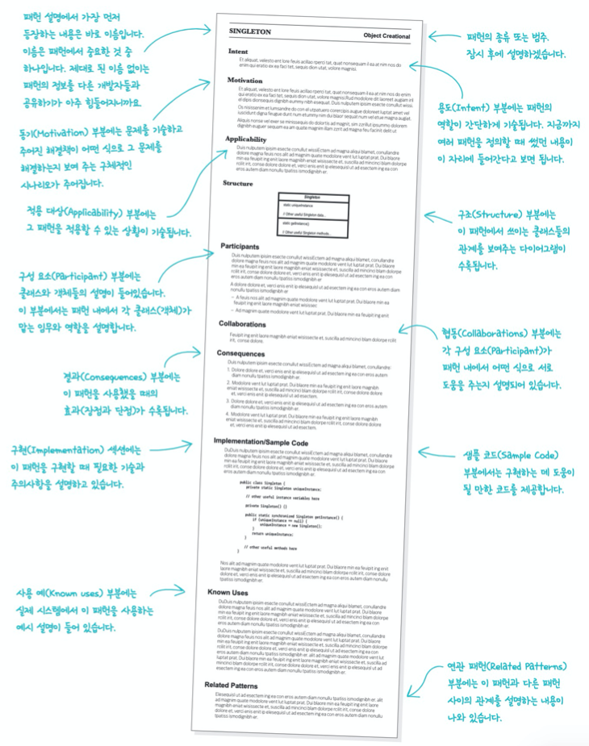
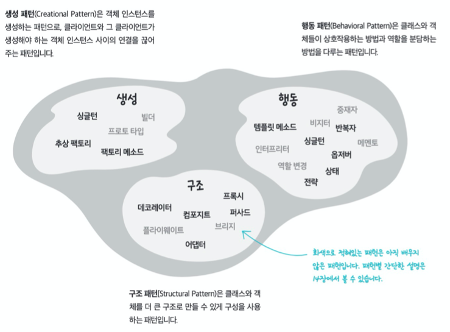
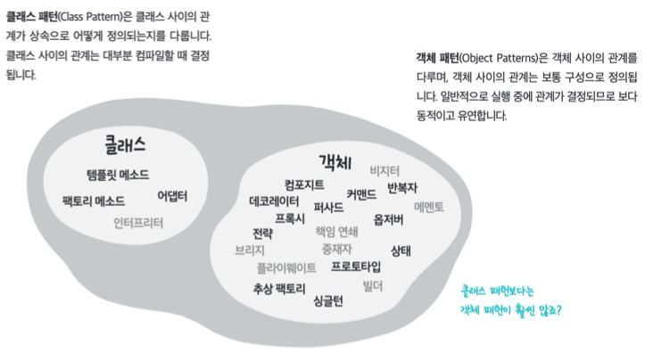

# CHAPTER 13. 실전 디자인 패턴

패턴의 정의는 다음과 같다.

> **패턴**(Pattern)은 특정 컨텍스트 내에서 주어진 문제의 해결책이다.

- 컨텍스트(context): 패턴이 적용되는 상황을 뜻한다. 반복적으로 일어날 수 있는 상황이어야 한다.
- 문제(problem): 컨텍스트 내에서 이뤄야 하는 목표를 뜻한다. 컨텍스트 내의 제약조건도 포함된다.
- 해결책(solution): 찾아내야 하는 것. 제약조건 속에서 누가 적용해도 목표를 이룰 수 있는 일반적인 디자인을 뜻한다.

= 즉, "어떤 컨텍스트 내에서 일련의 제약조건에 의해 영향을 받는 문제가 발생했다면, 그 제약조건 내에서 목적 달성을 위한 해결책이 되는 디자인을 적용하면 된다."

## 디자인 패턴의 정의 자세히 살펴보기

다음의 경우에는 패턴이라고 할 수 없다.

- 문제: 어떻게 회사에 제시간에 도착할 것인가?
- 컨텍스트: 차에 자동차 열쇠를 두고 나왔는데 문이 잠겼다.
- 해결책: 유리를 깬다. 차에 들어간다. 차를 몰고 출근한다.

패턴이라고 할 수 없는 이유.

1. 가끔 차 안에 열쇠를 두고 내렸다가 잠기는 일이 발생할 수도 있지만, 그런 상황에서 차 유리를 깨는 방법은 반복적으로 적용할 수 있는 해결책이 아니다. (반복할 수 있더라도, 비용이라는 또 다른 제약조건을 벗어날 수 없다.)
2. 다른 사람에게 해결책을 알려줘서 적용하기 힘들 다는 것.

패턴 카탈로그에는 일련의 패턴을 정해서 각각의 패턴을 다른 패턴과 비교하며 자세하게 설명해준다.

## 새로운 디자인 패턴 발견하기

- 숙제를 먼저 합시다.
  - 이미 존재하는 기존의 패턴들을 확실하게 파악해야한다. 패턴을 알아보는 눈을 기르고 다른 패턴과 연관 짓는 능력이 필요하다.
- 오랜 시간에 걸쳐서 심사숙고해 보세요.
  - 대부분의 패턴은 새로운 것을 발견했다고 생각하지만 기존의 패턴을 변형한 것에 불과하거나 적용 범위가 너무 좁아서 진짜 패턴이라고 하기 힘든 것도 많다.
- 머릿속에 들어있는 아이디어를 남들도 이해할 수 있도록 종이 위에 적어 보세요.
  - 새로운 패턴을 발견한 것 같다면, 다른 사람들이 직접 적용해보고 피드백을 제공할 수 있도록 문서로 만들어 보자.
- 새로운 패턴을 다른 사람들이 사용하게 해서, 계속 다듬어 보세요.
  - 패턴은 한 번에 완성하긴 어렵다. 시간이 지남에 따라 점점 더 나아진다고 생각하자.
- 3의 규칙을 잊지 마세요.
  - 패턴이 실전 문제 해결에 3번 이상 적용되어야 패턴 자격을 얻을 수 있다.

## 디자인 패턴 분류하기

점점 더 많은 디자인 패턴이 발견됨에 따라 디자인 패턴을 찾거나 같은 그룹에 속하는 패턴끼리 비교하기 좋게, 종료에 따라 분류할 필요성이 생겼다.

보통 <u>생성, 행동, 구조라는 3가지 범주로 용도</u>에 따라 나눈다.

위의 범주와는 별개로, 클래스를 다루는 패턴인지, 객체를 다루는 패턴인지에 따라 패턴을 분류하는 방법도 있다.

## 패턴으로 생각하기

패턴으로 생각한다는 것은 어떤 디자인을 봤을 때 패턴 적용 여부를 결정할 수 있는 안목을 가진다는 뜻이다.

- 최대한 단순하게
  - 이 문제에 "어떻게 패턴을 적용할 수 있을까"가 아닌 "어떻게 하면 단순하게 해결할 수 있을까"에 초점을 맞춰야한다.
  - **패턴으로부터 디자인을 구축하면 안된다.**
- 디자인 패턴은 만병통치약이 아닙니다
  - 패턴을 사용할 때는 그 패턴이 여러분이 설계한 디자인에 미칠 영향과 결과를 주의 깊게 생각해 봐야 한다.
- 패턴이 필요할 때
  - 디자인상의 문제에 적합하다는 확신이 든다면 패턴을 도입해야 한다.
  - 간단한 해결책으로 문제가 해결되는 데도 시스템의 어떤 부분이 변경될 거라고 예측되는 상황에서는 디자인 패턴을 적용해야 한다.
  - 가능성이 그리 높지 않은 가상적인 변경에 대비해서 패턴을 적용하는 일은 바람직하지 않다.
  - 패턴 도입을 디자인 단계에서만 고려해야 하는 것은 아니다. 나중에 리팩터링을 할 때도 패턴 도입을 고려할 수 있다.
- 리팩터링과 패턴
  - 리팩터링의 목적은 행동 변경이 아니라 구조 개선에 있다.
- 꼭 필요하지 않은 패턴은 빼버립시다. 지금 이는 디자인에서 디자인 패턴을 제거하는 일을 두려워하지 마세요.
  - 시스템이 점점 복잡해지면서 처음에 기대했던 유연성이 전혀 발휘되지 못한다면 패턴을 과감하게 제거해 버리는 게 낫다.
- 꼭 필요하지 않은 패턴을 미리 적용할 필요는 없다.
  - 꼭 필요하지 않은 데도 괜히 패턴을 추가하는 일은 피해야 한다. 괜히 시스템만 복잡해지고, 나중에 그 패턴을 사용하지 않을 수도 있다.

## 전문 용어의 위력 되새기기

디자인 패턴은 의사소통에서도 큰 도움이 된다. 디자인 패턴은 문제를 해결하는 방법이지만, 개발자들 사이에서 의사소통을 하는 데 필요한 용어를 제공하기도 한다.

- 용어를 공유하는 5가지 방법
  - <u>디자인 회의에서</u> 디자인 패턴을 사용하면 '디자인 자체'에 더 많은 시간을 할애할 수 있다.
  - <u>다른 개발자들과 토론할 때</u> 사용하면 새로운 패턴을 배우는 데에도 도움이 되고, 커뮤니티를 구축하는 데도 도움이 된다.
  - <u>아키텍처 문서에</u> 패턴을 활용하면 적은 분량으로 디자인을 분명하게 설명할 수 있다.
  - <u>코드 주석을 달 때</u> 어떤 패턴을 사용하고 있는지 적자. 그리고 <u>클래스와 메소드 이름을 만들 때도</u> 사용중인 패턴이 분명하게 드러날 수 있도록 하자.
  - <u>개발자 모임에서</u> 여러분이 알고 있는 것을 다른 사람들에게도 알려 주자.

## 핵심 정리

- 디자인 패턴을 자연스럽게 적용하자. 패턴은 억지로 적용하면 안된다.
- 패턴은 필요에 따라 적당히 변형해서 사용하자.
- 주어진 조건을 만족하는 가장 간단한 해결책을 사용하자. 디자인 패턴을 무조건 써야 하는 것은 아니다.
- 디자인 패턴 카탈로그를 읽어보고 패턴을 숙지하자.
- 패턴을 분류해서 패턴 그룹을 만들 수 있다.
- 패턴을 만들기 위해서는 대단한 노력이 필요하고 오랜 시간 패턴을 다음어야 한다.
- 주변 사람들과 전문 용어를 공유하자. 공통의 언어로 얘기 할 수 있다는 점이 패턴의 가장 큰 장점이다.